# Lab 1 - Publishing and Accessing Reports

**Contents** 

<!-- TOC -->

- [Introduction](#introduction)
- [Power BI Service](#power-bi-service)
  - [Power BI Service – Publishing Reports](#power-bi-desktop-publishing-reports)
  - [Power BI – Building a Dashboard](#power-bi-desktop-building-a-dashboard)
- [References](#references)

## Introduction

At the end of this lab, you will have completed a full report that is ready to be published to the Power BI Service. By creating the report, you will have learned how to do conditional formatting, add a logo to the manufacturer filter, import a custom visual, and apply a custom theme to the report. By the end of this lab, you will have also learned how to add bookmarks to tell a story about the report.

The flow of this document includes screenshots to provide a visual aid for you and text descriptions of the steps you need to follow. In the screenshots, sections are highlighted with red or orange boxes to indicate the action or area on which you need to focus.

**NOTE:** This lab uses real, anonymized data provided by ObviEnce, LLC. Visit their site to learn about their services: www.obvience.co[m](http://www.obvience.com/)[.](http://www.obvience.com/)This data is the property of ObviEnce. LLC and has been shared to demonstrate Power BI functionality with industry sample data. Any use of this data must include this attribution to ObviEnce, LLC.

## Power BI Service

You will now leverage a report authored using Power BI Desktop to create a dashboard for the VanArsdel data analysis team and CMO. A Power BI Desktop file with additional reports and visuals is provided. Please use this file for the next section of the lab.

### Task 1 - Power BI Service – Publishing Report

   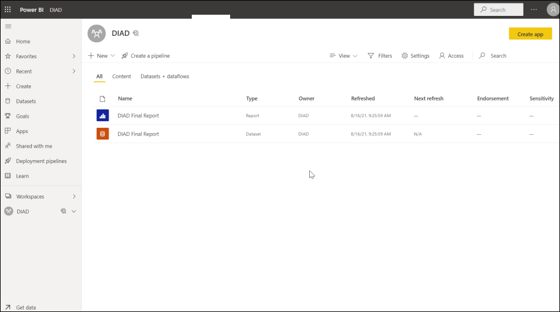

1. If you have not signed up for a Power BI account, go to <http://aka.ms/pbidiadtraining>and sign up for Power BI with a business email address.

2. If you have not already opened the **app.powerbi.com** page, please open a browser and navigate to [http://app.powerbi.com](http://app.powerbi.com/)[.](http://app.powerbi.com/)

3. Sign-in to Power BI using your user account. Once logged in, you will be taken to the **Home** screen.

   >**Note**: If you have previously signed into Power BI, then your **Home** screen will list your **Favorites** plus recent reports and dashboards.

    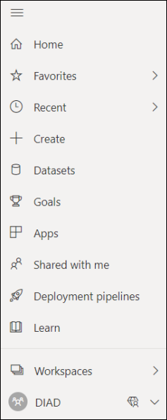

4. If the left navigation is collapsed, click the  (menu) icon below Power BI on the top left side of the screen to expand the left navigation.

   The following options are listed in the left navigation:

- **Home**: This is a one-stop-shop for all your content. It lists your favorite and recent content such as reports, dashboards, and apps. It also shows the most recent content that was shared with you.

- **Favorites**: Lists all your favorite content. We will create a favorite in a later section.

- **Create**: Allows you to add data manually or use an already existing dataset.

- **Datasets**: Lists all available datasets that have been published.

- **Goals**: Create scorecards to track goals setup by the users

- **Recent**: Lists the most recent content you have viewed.

- **Apps**: List all the apps you have installed.

- **Shared with me**: Lists the content that is shared with you. We will share dashboards in a later section.

- **Deployment pipelines**: Allows the user to manage workspace content with deployment stages.

- **Workspaces**: Lists all the workspaces you are assigned. By default, you are assigned to **My Workspace**.

   Click the down arrow next to **My Workspace**. Notice the Dashboards, Reports, Workbooks, and Datasets sections. 
   Let’s import a Power BI Desktop file and create dashboards.

   My Workspace is your personal workspace. We need to create a workspace where we can collaborate with team members and distribute content to end-users. To do this we’ll create a new workspace.

5. In the left panel, click **Workspaces** and then click **Create a workspace**. The **Create a workspace** dialog box opens.

   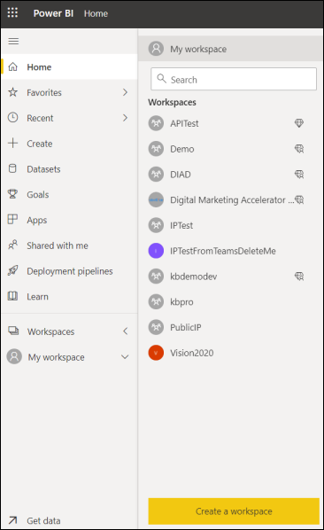

   >**Note**: Creating workspace is a **Pro feature**. If you do not have a Pro license, please choose the trial option.

6. In the **Create a workspace** dialog box, click **Upload**.

7. A file browser dialog box opens. Browse to the **DIAD** folder and then the **Data** folder (**/DIAD/Data**). Click **VanArsdel\_WSLogo** file.

8. In the **Name your workspace** text area, type **DIAD\_<youremailaddress>**.

9. In the **Description** text area, type **This is DIAD workspace**.

10. Click **Save** to create the workspace.

    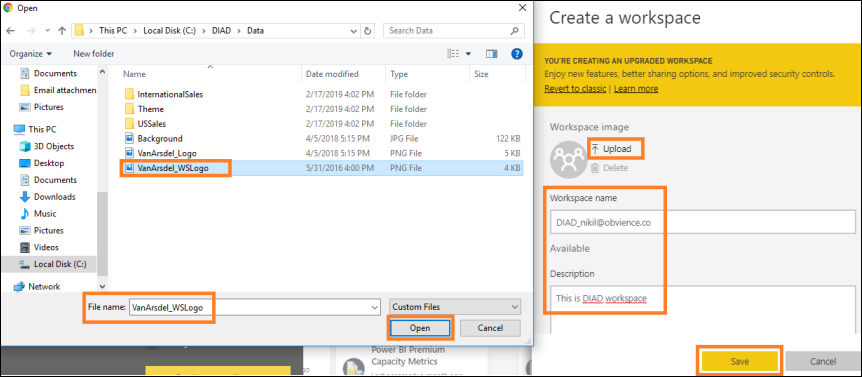

    >**Note**: You are entering your email address as part of the workspace name to keep it unique.

      
  
    Notice that you have navigated from My Workspace to the workspace \ just created. You are in the **Welcome** screen with options to discover or create content.

       **Add content** has options to connect to Files, Databases, and Dataflows.

       There are two options to publish the Power BI Desktop report we created:

     - **Get** option under Files.

     - **Publish** from Power BI Desktop.

    We are going to use the **Publish** from Power BI Desktop option.

    Let’s publish the report to Power BI Service and then we will come back to the browser.

11. Navigate back to the **DIAD Final Report.**

12. Ensure **Mobile View** is **off.**

13. From the **Home** tab, click **Publish.**

    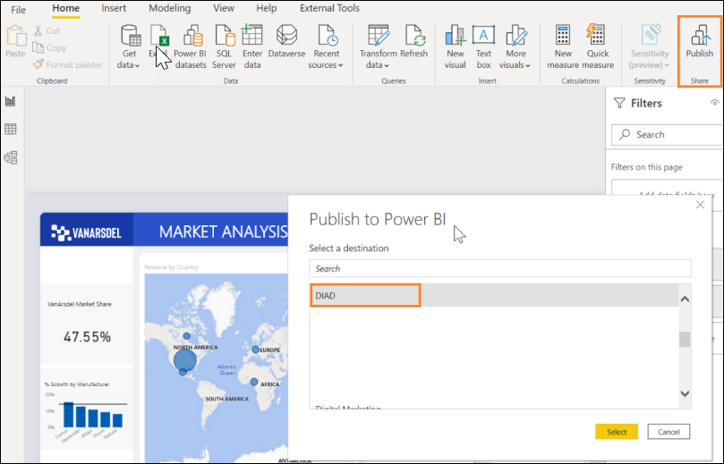 
  
14. If you have not already logged into Power BI, a **Sign in** dialog box opens. Please sign in.

15. Once you are signed in, the **Publish to Power BI** dialog box opens. Click **DIAD\_<youremailaddress>** in the dialog box.

16. Click **Select**.

    The **Publishing to Power BI** dialog box opens. Once the process is complete, a success message displays.

    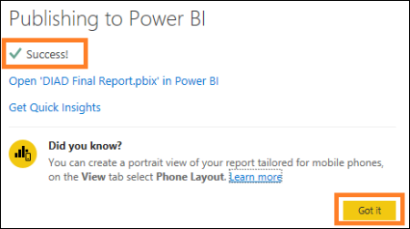  
  
17. Click **Got it** to close the dialog box.

    Now that we have published the report to the Power BI service, let’s navigate back to the browser and start exploring. 
  
     
  
Once you are in the browser, in the left panel notice that under **DIAD\_<youremailaddress>**, you see **Reports** has the **DIAD Final Report**, and **Datasets**, has the **DIAD Final Report**.

### Task 2- Power BI – Building a Dashboard

In this section, we will create a dashboard that combines data from the **Market Share** report. 
  
By the end of this section, we will have created a dashboard that looks like the screenshot below.

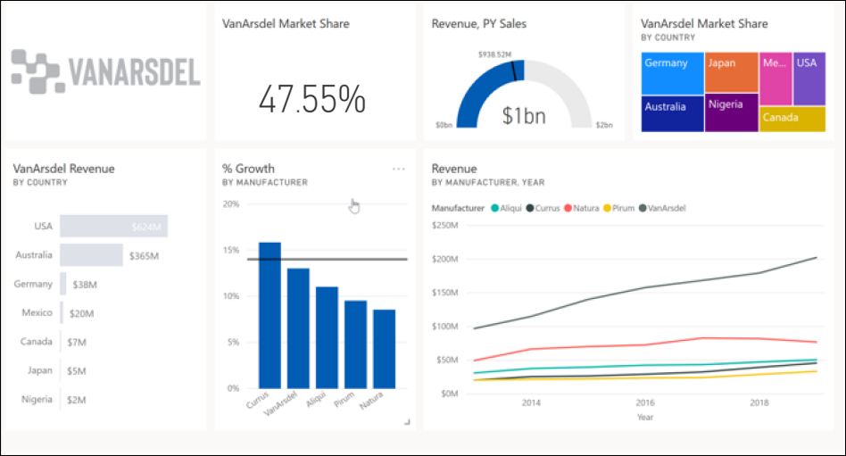
  
1. From the left menu, click **Reports** and then click the **DIAD Final Report.** You are navigated to the report you just uploaded.   

    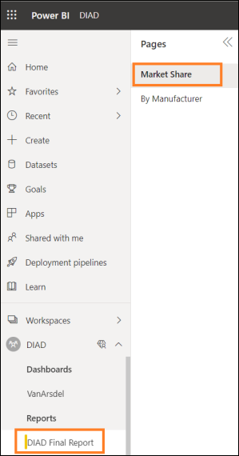
  
2. In the **map visual**, enable drill-down by **hovering** over the visual.

3. Click the **down arrow** on the top right corner of the visual.

4. Select **Australia** to drill-down to the **State** level.

    Now let’s pin visuals to the dashboard.

5. Hover over the **VanArsdel Market Share** card visual.

6. Click the **pin** icon on the top right of the visual. The **Pin to dashboard** dialog box opens.

7. We do not have a dashboard yet. Let’s create one. With **New dashboard** selected, enter **VanArsdel** in the text box.

8. Click **Pin**.
  
    
 
   Notice that alert messages are displayed stating the dashboard is ready to view.

   Notice in the left panel, the **VanArsdel** dashboard is created under **Dashboards**.

      
  
9. From the left panel, click **Dashboards** then click **VanArsdel**.

   Notice the **VanArsdel Market Share** tile is pinned to the dashboard.

10. Click **VanArsdel Market Share,** notice that you are navigated to the report.

>**Note:** Tiles in the dashboard are not interactive.

11. Hover over the **% Growth by Manufacturer** visual.

12. Click the **pin** icon on the top right of the visual. The **Pin to dashboard** dialog box opens.

13. Make sure that **VanArsdel** is selected in the drop-down.

14. Click **Pin**.

    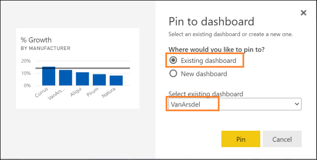
  
15. Closeout the alert dialog boxes.

16. Hover over the **Revenue by Year and Manufacturer** visual.

17. Click the **pin** icon on the top right of the visual. The **Pin to dashboard** dialog box opens.

18. Make sure **VanArsdel** is selected in the drop-down.

19. Click **Pin**.

    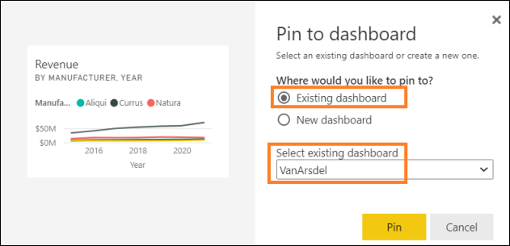
   
20. Closeout the alert dialog boxes.

21. Navigate to the **By Manufacturer** page.

22. From the top right corner, click the **down arrow**. Notice that the **manufacturer** slicer displays.

23. Click **VanArsdel** in the slicer. This will filter the visuals.

24. From the top right corner, click the **up arrow**. Notice that the **manufacturer** slicer collapses.

    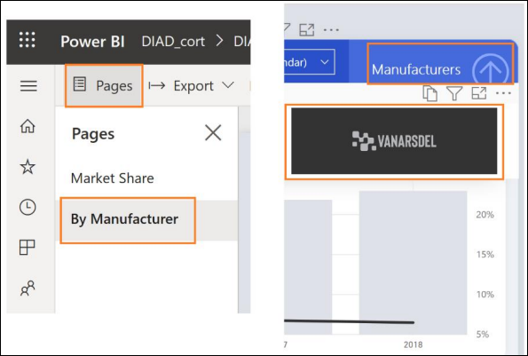
  
25. Pin the **gauge visual** to the dashboard.

26. Pin the **Revenue by Country** visual to the dashboard.

27. Closeout the alert dialog boxes.

    
  
>**Note:** The **VanArsdel** filter is applied to the tile that is pinned to the dashboard.

28. From the left panel, select the three lines in the upper left-hand corner, click **Dashboards**, and then click **VanArsdel**. Notice that all the visuals are pinned as tiles to the dashboard.

        

     You will see the visuals on the dashboard like in the screenshot. Each visual on the dashboard is called a tile. The tiles represent the data chosen and are kept up to date as the data in the data model updates. Tiles are not interactive.

    Let’s organize the dashboard.

29. Resize and move the **gauge** tile as shown in the screenshot.

30. Click the bottom right corner of the tile and move it diagonally to change the image size.

    
  
    Tiles can be of various sizes (1x1 to 5x5). Drag the tile using the bottom right corner to resize it. As you are dragging, note the gray shadow which indicates the size of the tile when you stop dragging.

31. Click the **Edit** dropdown and click **Add tile**. The **Add tile** dialog box opens.

32. Click **Image** as the source.

33. Click **Next**.

34. In the **URL** text box, type the following URL: <https://raw.githubusercontent.com/CharlesSterling/DiadManu/master/Vanarsdel.png>

    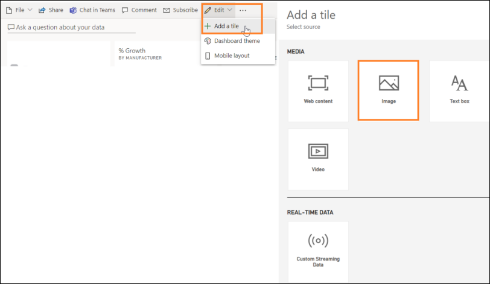
  
    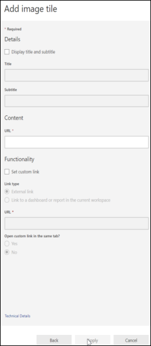
  
>**Note:** The URL is case sensitive.

35. Click **Apply**.

    Notice that a new tile with the **VanArsdel** logo is added to the dashboard.

    
  
36. Resize and rearrange the tiles as shown in the screenshot.

    The **Revenue by Country** tile shows Revenue by Country for VanArsdel, let’s rename it.

37. Hover over **Revenue by Country** tile.

38. Click the ellipse in the top right corner of the tile.

39. Click **Edit Details**. The **Tile Details** dialog box opens.

40. Change the **Title** to **VanArsdel Revenue**.

41. Click **Apply.**

    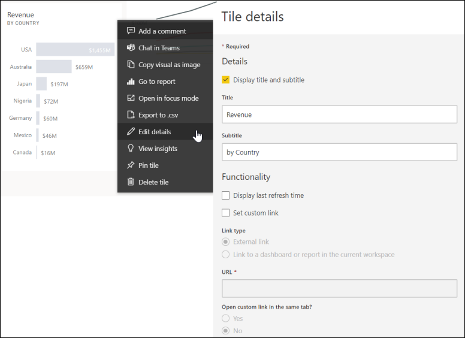

    Now let’s create a visual that represents Market Share by country.

    Notice on the top of the visual, there is an option to **Ask a question about your data**. This is like **Ask a question in the desktop**.

42. In the text box, start typing **VanArsdel market share.** Notice that a card visual is created.

43. Continue typing **VanArsdel market share by country**. Notice that a bar chart is created.

44. Continue typing **VanArsdel market share by country as treemap**. Notice that a treemap visual is created.

    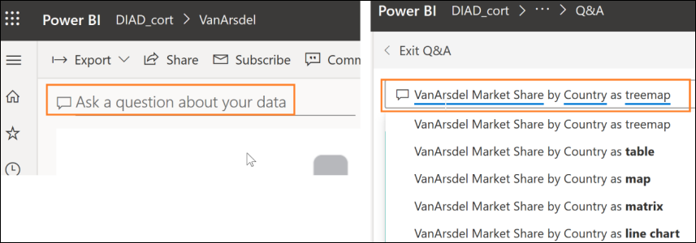
  
>**Note**: Remember that we renamed our tables. One of the reasons we did this was to make them user friendly for Q & A

45. In the top right of the screen, click **Pin Visual**.

46. The **Pin to dashboard** dialog box opens. Click **Pin** to pin the visual to the **VanArsdel** dashboard.

    
    
47. Close the alert dialog boxes.

48. Click **Exit Q&A** to navigate back to the dashboard.

    Notice that the visual is added as tile to the dashboard. Clicking on the treemap visual will navigate you back to the Q & A section.

    Power BI quickly searches different subsets of your dataset while applying a set of sophisticated algorithms to discover potentially interesting insights. You can run insights against a dataset or a dashboard tile.

    Let’s generate insights on a dashboard tile. When we run insights on a dashboard tile, instead of searching for insights against an entire dataset, the search is narrowed to the data used to create a single dashboard tile. This is often referred to as scoped insights.

49. Hover over the **line chart** on the dashboard.

50. Click the **ellipse** on the top right corner.

51. Click **View Insights**.

    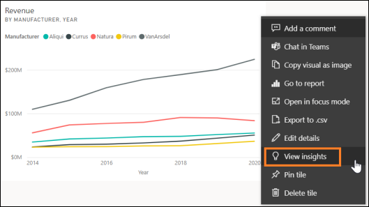
  
    You will be navigated to **Focus mode** for the line chart.

52. Scroll on the Insights panel to review the various insights Power BI can generate. Notice that there is an option to pin insight visuals to the dashboard.

    

53. Click **Exit Focus mode** in the top left to navigate back to the dashboard.

    We want to be notified when VanArsdel’s Market Share goes above or below a threshold. We can set up alerts to achieve this.

54. Hover over **VanArsdel Market Share** tile.

55. Click on the **ellipse** in the top right corner of the tile.

56. Click **Manage alerts**. The **Manage alerts** dialog box opens.

57. Click **Add alert rule** dialog.

    
  
    Notice that you can add **Above** or **Below threshold**. You can also set the notification frequency. This is just an introduction to managing alerts. Complete functionality is not covered in this lab.

58. Click **Cancel** to close the dialog box.

59. Click **Don’t Save**.

60. Click on the **VanArsdel Market Share** tile to navigate to the report.

61. In the map visual, ensure it is at the **Country** level, right-click the **Australia** bubble, click **Drill through**, and click then **By Manufacturer**. 
  
    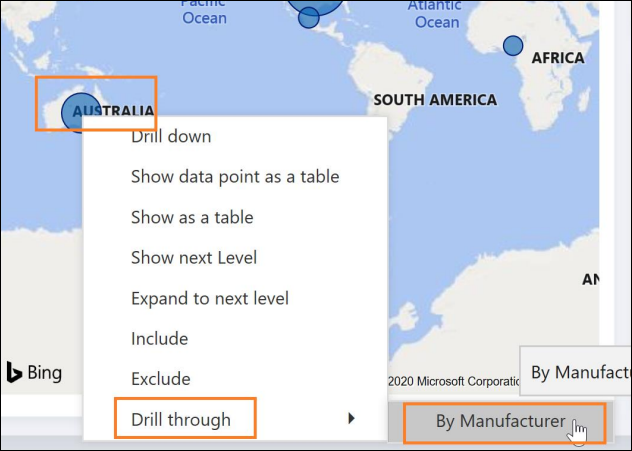

    You will be navigated to the **By Manufacturer** page of the report with the **Australia** filter applied to the report page.

62. Hover over the **matrix** visual.

63. Click the **focus mode** icon on the top right corner of the visual.

64. Click the double-down arrow to drill down.

65. Click **Back to report.**

    
  
66. From the top menu, click **Bookmarks** and then click **Show more bookmarks**. The **Bookmark** pane opens on the right. There are two options: **Personal** bookmarks and **Report** bookmarks.

    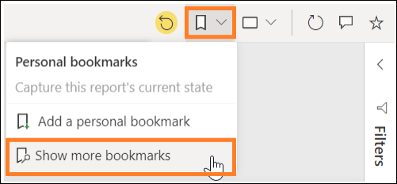
  
- Report bookmarks are the bookmarks the report author created (we did this in Power BI Desktop).

- Personal bookmarks on the report are ones which the consumer can create on their own.

67. Click **View** in the **Report** bookmarks pane.

    Notice that you can view and navigate through the bookmarks using the arrow at the bottom of the screen. This behavior is like in Power BI Desktop.

      
  
68. Click **Exit** in the **Bookmark** pane to close it.

    Power BI provides an option to get quick insights into the complete dataset.

69. Navigate back to the Power BI Service. In the left panel, hover over **Datasets** and then click **DIAD Final Report**.

70. Click the **ellipse**.

71. Click **Get quick Insights**.

    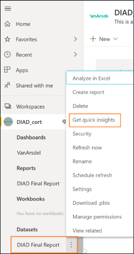
  
    It might take a few minutes for the insights to be created. Once insights are ready, a message appears in the top right corner.

72. Click **View insights.**

    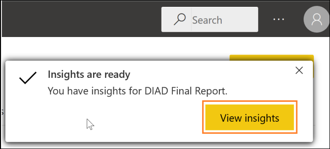
  
    A quick insights report is displayed based on the dataset. This provides insights into data you may have missed and helps to get a quick start on creating dashboards. Hovering over each report provides an option to **Pin it** to a dashboard.

    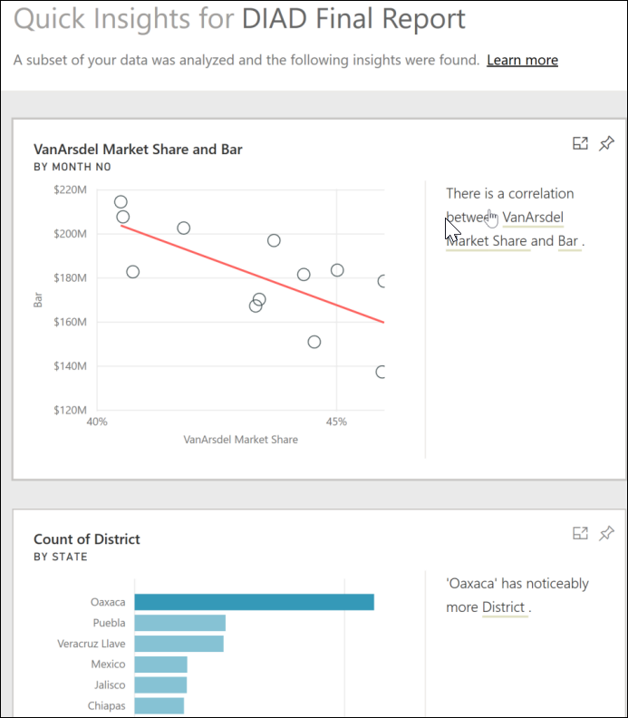  

You’ve now completed Lab four! Throughout this lab, you have learned how to apply conditional formatting, add a logo to the manufacturer filter, import a custom visual, and apply a custom theme to the report. You also learned how to add bookmarks to tell a story about the report.

## References

Dashboard in a Day introduces you to some of the key functions available in Power BI. In the ribbon of the Power BI Desktop, the Help section has links to some great resources.

   

Here are a few more resources that will help you with your next steps with Power BI.

  - Getting started: http://powerbi.com
  - Power BI Desktop: https://powerbi.microsoft.com/desktop
  - Power BI Mobile: https://powerbi.microsoft.com/mobile
  - Community site https://community.powerbi.com/
  - Power BI Getting started support page: https://support.powerbi.com/knowledgebase/articles/430814-get-started-with-power-bi
  - Support site https://support.powerbi.com/
  - Feature requests https://ideas.powerbi.com/forums/265200-power-bi-ideas
  - New ideas for using Power BI https://aka.ms/PBI_Comm_Ideas
  - Power BI Courses http://aka.ms/pbi-create-reports
  - Power Platform https://powerplatform.microsoft.com/en-us/instructor-led-training/
  - Power Apps [Business Apps | Microsoft Power Apps](https://powerapps.microsoft.com/en-us/)
  - Power Automate [Power Automate | Microsoft Power Platform](https://powerapps.microsoft.com/en-us/)
  - Dataverse [What is Microsoft Dataverse? - Power Apps | Microsoft Docs](https://docs.microsoft.com/en-us/powerapps/maker/data-platform/data-platform-intro)

