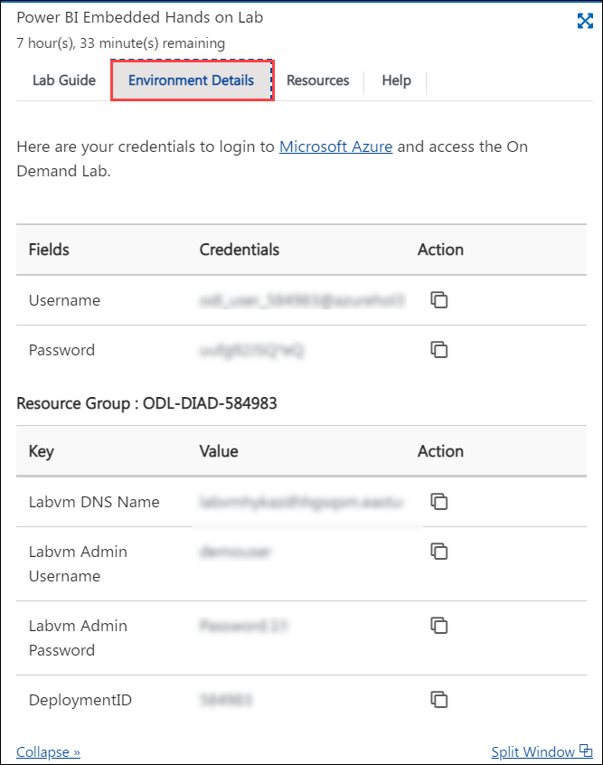
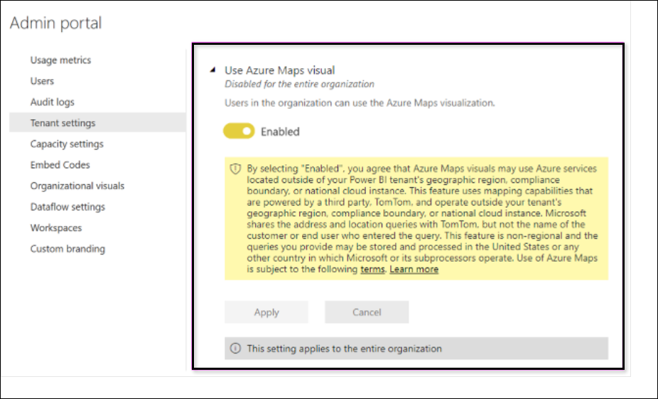
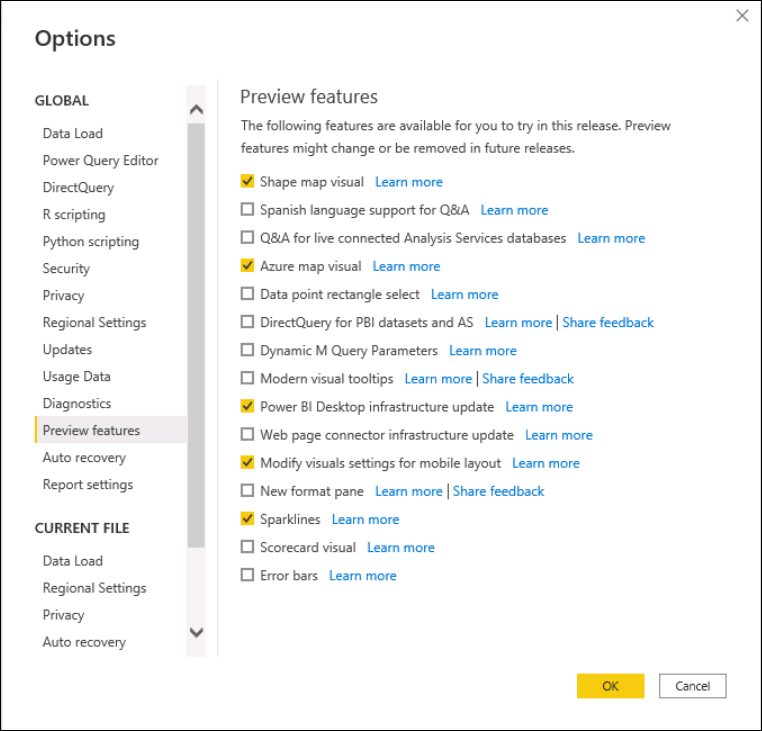
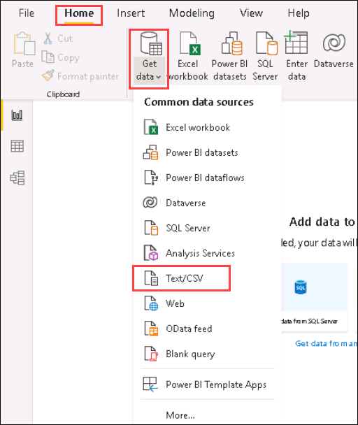
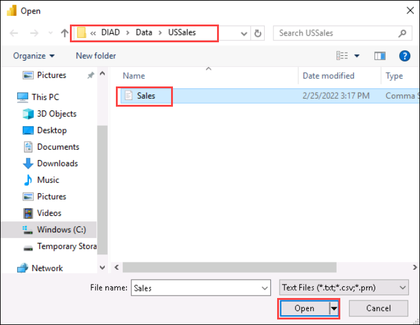
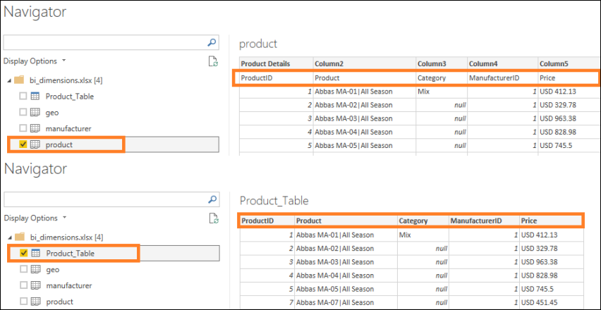
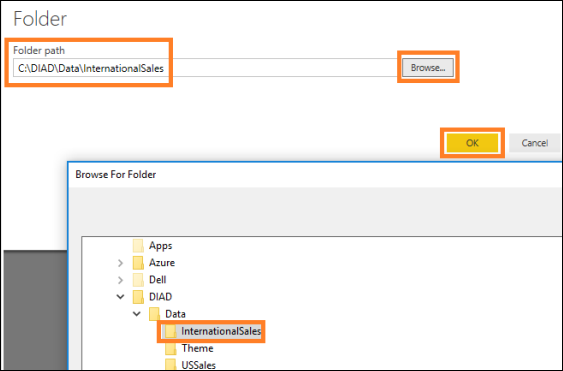
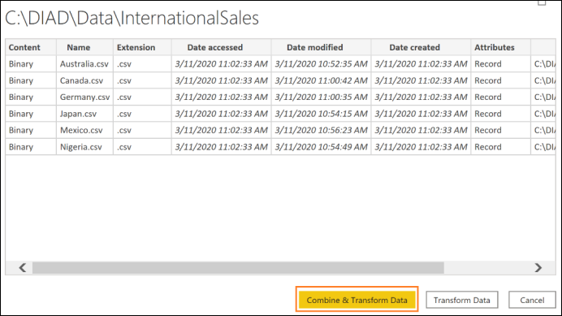
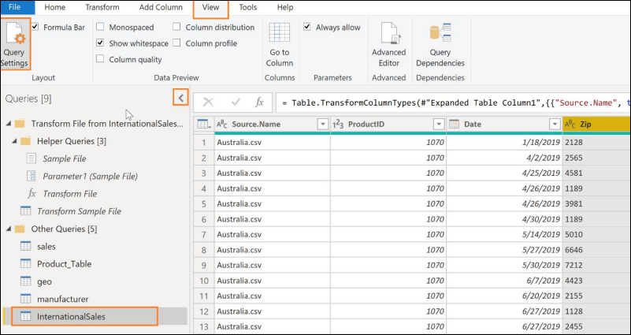

# Lab 1 - Accessing Data

**Contents** 

<!-- TOC -->

- [Introduction](#introduction)
  - [Getting Started with the lab](#Getting-started-with-Lab)
- [Before the hands-on lab](#Before-the-hands-on-lab)
- [Power BI Desktop](#power-bi-desktop)
  - [Power BI Desktop – Accessing Data](#power-bi-desktop-accessing-data)
- [References](#references)

## Introduction

Today you will learn about various key features of the Power BI service. This is an introductory course intended to teach you how to author reports using Power BI Desktop, create operational dashboards,
and share content via the Power BI Service.

By the end of this lab, you will have learned:

- How to load data from Microsoft Excel and Comma-Separated Values (CSV) sources 
- How to manipulate the data to prepare it for reporting
- How to prepare the tables in Power Query and load them into the model

### Getting Started with Lab

1. Once the environment is provisioned, a virtual machine (JumpVM) on the left and lab guide on the right will get loaded in your browser. Use this virtual machine throughout the workshop to perform the lab.

2. To get the lab environment details, you can select the **Lab Environment** tab, you can locate the **Lab Environment** tab on the upper right corner. Additionally, the credentials will also be emailed to your email address provided during registration.

   

## Before the hands-on lab

**Duration**: 30 minutes

You should follow all of the steps provided in this section _before_ taking part in the hands-on lab ahead of time as some of these steps take time.

1. Sign in to https://app.powerbi.com/ using your admin account credentials and click **Submit**.

   * Email/Username: <inject key="AzureAdUserEmail"></inject>

2. Enter the following **Password** and click on **Sign in**. 
   
   * Password: <inject key="AzureAdUserPassword"></inject>   
   
3. Click **Skip for now (14 day until this is required)** 

4. If you see the pop-up **Stay Signed in?**, click **No**. Also, if you see a Save Password popup, close that.

5. Select **Contine** under *Thank you for choosing Microsoft PowerBI page* and provide your phone number when asked for the account info.

6. Check-in the box where you are asked for permission to share the account info to get the product and service updates and click on **Get started**.

7. Once every details are checked and confirmed again clcik **Get started** to continue.

8. From the page header, select ... > **Settings** > **Admin portal**.

   

9. Select **Tenant settings** under Admin Portal and scroll down to **Use Azure Maps visual** to **Enabled**

   

10. Click **Apply**

11. **Sign out** and then **Sign in** to the account for changes to get applied.

## Power BI Desktop – Accessing Data

In this section, you will import VanArsdel’s and its competitors’ USA sales data. You will then import and merge sales data from other countries.

### Task 1: Power BI Desktop - Get Data

The dataset contains sales data of VanArsdel and other competitors. We have seven years of transaction data by day, product, and zip code for each 
manufacturer. We are going to analyze data from seven countries.

USA sales data is in a CSV file located in the USSales subfolder within the Data folder (/Data/USSales).

Sales of all other countries is in the InternationalSales subfolder within the Data folder (/Data/InternationalSales). Each country’s sales data is in a CSV file in this folder.

Product, Geography, and Manufacturer information is in a Microsoft Excel file called bi_dimensions.xlsx in the USSales subfolder within the Data folder (/Data/USSales/).
   
 1. Open the **Power BI Desktop** and launch it now.
 
 2. Click **Already have a Power BI Account? Sign in** option.

 3. **Sign in** using your Power BI credentials.

    > **Note**: Please use the **Username** and **Password** credentials details from the Environment Details tab. When prompted to sign-in select the odl user accoount details.

 4. You will see the startup screen opens. Click on the **X** on the top right corner of the dialog box to close it.

 5. New format pane feature is released as part of the February 2022 update. This feature is in **Preview**. We will disable this feature for the labs. To disable it, navigate to **File -> Options and settings -> Options**. Options dialog opens. On the left panel select **Preview features** and **uncheck New Format pane** and ensure **Azure map visual** and **Shape map visual** options are checked and select **OK** to close the dialog. You may have to **restart** Power BI Desktop.
 
    

  Let’s set the **Locale** to US English to make it convenient in the rest of this lab.
 
6. From the ribbon, click **File**, then click **Options and settings**, then click **Options**.
 
    
 
7. In the left panel of **Options** dialog box, click **Regional Settings** under Current File.

8. From the Locale drop-down, click **English (United States)**.

9. Click **OK** to close the dialog box.

    
    
    The next step is to load data to Power BI Desktop. We will load USA Sales data which is in CSV files.
    
10. From the ribbon, click **Home** and then click the **Get Data** drop-down arrow.

11. Click **Text/CSV**.

    
    
   >**Note**: Power BI Desktop has the capability to connect to 300+ data sources. We are using CSV and Excel data files in this lab for simplicity. If you would like a full list of data sources, please visit this link: https://docs.microsoft.com/en-us/power-bi/connect-data/desktop-data-sources

12. Browse to **Local Disk(C:)> DIAD**, double-click **Data**, double-click the **USSales** folder, and then click **sales.csv**.

13. Click the **Open** button.

    
    
    Power BI detects the data type within each column. There are options to detect the data type based on the first 200 rows, based on the entire dataset or to not detect the data. Since our dataset is large and it will take time and resources to scan the complete dataset, we will leave the default option of selecting the dataset based on the first 200 rows.
    
    After completing your selection, you have three options – Load, Edit or Cancel.
    
      - **Load** adds the data from the source into Power BI Desktop for you to start creating reports.
      - **Transform** Data allows you to perform data shaping operations such as merging columns, adding additional columns, changing data types of columns as well as bringing in additional data. 
      - **Cancel** gets you back to the main canvas. 

 14. Click Transform Data as shown in the screenshot. A new window opens.

     
     
     You should be in the Query Editor window as shown in the screenshot below. The Query Editor is used to perform data shaping operations. Notice that the sales file you connected to shows as a query in the left panel. You can see a preview of the data in the center panel. Power BI predicts the data type of each field (based on the first 200 rows) as indicated next to the column header. In the right panel, steps that the Query Editor performs are recorded in the Applied Steps section.    
     
     
     
     >**Note**: You will bring in sales data from other countries as well as performing certain data shaping operations.

15. Notice that Power BI has set the **Zip** field to the data type **Whole Number**. To ensure that the leading zero is not dropped from Zip codes that start with zero, we will format them as **Text**. To do this, select the **Zip column**. Then, from the ribbon, click **Home**, click **Data Type**, and change it to **Text**.

16. The **Change Column Type** dialog box opens. Click the **Replace Current** button which overwrites Power BI’s predicted data type.

    
    
    Now let’s get the data that is in Excel source file.
    
17. From the ribbon, click **Home**, click **New Source**, and click then **Excel**.

    
    
18. Browse to **Local Disk(C:)> DIAD**, double-click **Data**, double-click the **USSales** folder, and then click **bi_dimensions.xlsx**.

19. Click the **Open** button. The **Navigator** dialog box opens.

    
    
20. The **Navigator** dialog box lists three sheets that are in the Excel workbook. It also lists the **Product** table. Click **product** in the panel on the left. In the preview panel, notice that the first row is the headers. This is not part of the data.

21. Now, deselect **product** from the left panel and click **Product_Table**. Notice that this table has only the contents of the named table. This is the data we need.

    
    
   >**Note**: Table names are differentiated from Worksheet names by using different icons.
    
22. From the left panel, click **geo**. In the preview panel, notice that the first few rows are headers and are not part of the data. We will remove them shortly.

23. From the left panel, click **manufacturer**. In the preview panel, notice that the last couple of rows are footers and are not part of the data. We will remove them shortly.

24. Make sure that **Product_Table**, **geo** and **manufacturer** are selected in the left panel, and then click **OK**. Notice all that three sheets are added as queries in the Query Editor.

    

## Task 2: Adding additional data

In this scenario, the international subsidiaries have agreed to provide their sales data so that the company’s sales can be analyzed together. You’ve created a folder where they each put their data.

To analyze all the data together, you import the new data from each of the subsidiaries and combine it with the US Sales you loaded earlier.

You can load the files one at a time, like how you loaded the US Sales data, but Power BI provides an easier way to load all the files in a folder together.

25. On the **Home** tab of the Query Editor, click on the **New Source** drop-down menu.

26. Click **More…** as shown in the figure.

    
    
27. The Get Data dialog box opens.

28. In the **Get Data** dialog box, click **Folder** as shown in the diagram.

29. Click **Connect** and the **Folder** dialog box will open.

    
    
30. Click the **Browse…** button.

31. In the **Browse** for Folder dialog box, navigate to the location where you unzipped the class files.

32. Open the **This PC> Windows(C:)> DIAD**.

33. Open the **Data** folder.

34. Click the **InternationalSales** folder.

35. Click **OK** (to close the **Browse for Folder** dialog box).

36. Click **OK** (to close the **Folder** dialog box).

    
    
      >**Note**: This approach will load all the files located in the folder. This is useful when you have a group that puts files on an FTP site each month and you are not always sure of the names of the files or the number of files. All the files must be of the same file type with columns in the same order.

The dialog box will display the list of files in the folder.

37. Click **Combine & Transform Data**.
 
    
    
     >**Note**: The data in your file for **Date accessed**, **Date modified**, and **Date created** might be different than the dates displayed in the screenshot. 

The **Combine Files** dialog box will open. By default, Power BI will again detect the data type based on the first 200 rows. Notice there is an option to select various file Delimiters. The file we are working with is Comma delimited, so let’s leave the Delimiter option as Comma.

There is also an option to select each individual file in the folder (using **Example File** drop-down) to validate the format of the files.

38. Click **OK**.

    

    You will now be in the **Query Editor** window with a new query named **InternationalSales**. 

39. If you do not see the **Queries** pane on left, click on the > (greater than) icon to expand. 

40. If you do not see the **Query Settings** pane on the right as shown in the figure, click on **View** in the ribbon and click **Query Settings** to see the pane. 

41. Click on the Query **InternationalSales**.

    
    
    Notice that column Zip is of the Whole Number type. Based on the first 200 rows, Power BI thinks theZip column consists of whole numbers. But zip code could be alpha numeric in some countries orregions or contain leading zeros. If we do not change the data type, we will receive an error when we load the data shortly. So, let’s change the Zip column to data type Text.
 
42. Highlight the **Zip** column and change the **Data Type** to **Text**.

43. The **Change Column Type** dialog box will open. Click the **Replace Current** button.

    
    
    In the Queries panel, notice that a Transform File from the InternationalSales folder is created. This contains the function used to load each of the files into the folder.

    
    
    If you compare the **InternationalSales** and the **sales** table, you will see the **InternationalSales** table contains two new columns, **Source.Name** and **Country**.

44. We do not need the **Source.Name** column. Click the **Source.Name** column and right click and select **Remove** option or you can select the **Source.Name** column and then click on **Manage Coloumns** and then select **Remove Coloumns**.
    
45. Next, click the drop-down menu next to the **Country** column to see the unique values. 

46. You will only see Australia as shown in the figure. By default, Power BI only loads the first 1000 rows. Click **Load more** to validate that you have data from the various countries included.

   
   
  Now, you will see the countries (blank), Australia, Canada, Germany, Japan, Mexico, and Nigeria.

   
    
47. Click **OK**.

   >**Note**: You can perform various types of filters, sorting operations using the drop-down to verify the imported data. 
     
## References

Dashboard in a Day introduces you to some of the key functions available in Power BI. In the ribbon of the Power BI Desktop, the Help section has links to some great resources.

   

Here are a few more resources that will help you with your next steps with Power BI.

  - Getting started: http://powerbi.com
  - Power BI Desktop: https://powerbi.microsoft.com/desktop
  - Power BI Mobile: https://powerbi.microsoft.com/mobile
  - Community site https://community.powerbi.com/
  - Power BI Getting started support page: https://support.powerbi.com/knowledgebase/articles/430814-get-started-with-power-bi
  - Support site https://support.powerbi.com/
  - Feature requests https://ideas.powerbi.com/forums/265200-power-bi-ideas
  - New ideas for using Power BI https://aka.ms/PBI_Comm_Ideas
  - Power BI Courses http://aka.ms/pbi-create-reports
  - Power Platform https://powerplatform.microsoft.com/en-us/instructor-led-training/
  - Power Apps [Business Apps | Microsoft Power Apps](https://powerapps.microsoft.com/en-us/)
  - Power Automate [Power Automate | Microsoft Power Platform](https://powerapps.microsoft.com/en-us/)
  - Dataverse [What is Microsoft Dataverse? - Power Apps | Microsoft Docs](https://docs.microsoft.com/en-us/powerapps/maker/data-platform/data-platform-intro)

