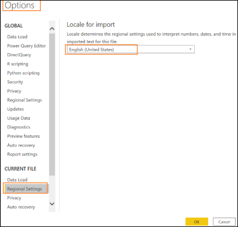
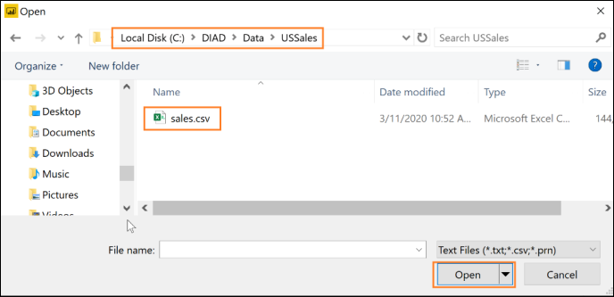

# Lab 1 - Accessing and Preparing Data

**Contents** 

<!-- TOC -->

- [Introduction](#introduction)
- [Power BI Desktop](#power-bi-desktop)
  - [Power BI Desktop – Accessing Data](#power-bi-desktop-accessing-data)
  - [Power BI Desktop – Data Preparation](#power-bi-desktop-data-preparation)
- [References](#references)

## Introduction

Today you will learn about various key features of the Power BI service. This is an introductory course intended to teach you how to author reports using Power BI Desktop, create operational dashboards,
and share content via the Power BI Service.

By the end of this lab, you will have learned:

- How to load data from Microsoft Excel and Comma-Separated Values (CSV) sources 
- How to manipulate the data to prepare it for reporting
- How to prepare the tables in Power Query and load them into the model

## Power BI Desktop

### Power BI Desktop – Accessing Data

In this section, you will import VanArsdel’s and its competitors’ USA sales data. You will then import and merge sales data from other countries.

### Power BI Desktop - Get Data

Let’s start by looking at the data files. The dataset contains sales data of VanArsdel and other competitors. We have seven years of transaction data by day, product, and zip code for each 
manufacturer. We are going to analyze data from seven countries.

USA sales data is in a CSV file located in the USSales subfolder within the Data folder (/Data/USSales).

Sales of all other countries is in the InternationalSales subfolder within the Data folder (/Data/InternationalSales). Each country’s sales data is in a CSV file in this folder.

Product, Geography, and Manufacturer information is in a Microsoft Excel file called bi_dimensions.xlsx in the USSales subfolder within the Data folder (/Data/USSales/).

1. Open the **bi_dimensions.xlsx file**. Notice that the first sheet has **Product** information. This sheet has a header, and product data is in a named table. Also notice that the **Category** column numerous
empty cells.

   The **Manufacturer sheet** has data laid out across the sheet, no column headers, several blank rows, and a note in row seven.

   The **Geo sheet** has the geography information. The first few rows have data details. Actual data starts on row four.
   
   
   
   We will start by connecting to data from these different sheets, and then perform data cleaning and transformation operations.
   
   
   
 2. If you don’t have the **Power BI Desktop** open, launch it now.
 
 3. Click **Already have a Power BI Account? Sign in** option.

 4. **Sign in** using your Power BI credentials.

 5. You will see the startup screen opens. Click on the **X** on the top right corner of the dialog box to close it.

 6. New format pane feature is released as part of the February 2022 update. This feature is in **Preview**. We will disable this feature for the labs. To disable it, navigate to **File -> Options and settings -> Options**. Options dialog opens. On the left panel select **Preview features** and **uncheck New Format pane**. Select **OK** to close the dialog. You may have to **restart** Power BI Desktop.

    Let’s set the **Locale** to US English to make it convenient in the rest of this lab.
 
 7. From the ribbon, click **File**, then click **Options and settings**, then click **Options**.
 
    
 
 8. In the left panel of **Options** dialog box, click **Regional Settings** under Current File.

 9. From the Locale drop-down, click **English (United States)**.

10. Click **OK** to close the dialog box.

    
    
    The next step is to load data to Power BI Desktop. We will load USA Sales data which is in CSV files.
    
11. From the ribbon, click **Home** and then click the **Get Data** drop-down arrow.

12. Click **Text/CSV**.

    
    
>**Note**: Power BI Desktop has the capability to connect to 300+ data sources. We are using CSV and Excel data files in this lab for simplicity. If you would like a full list of data sources, please visit this link: https://docs.microsoft.com/en-us/power-bi/connect-data/desktop-data-sources

13. Browse to **DIAD**, double-click **Data**, double-click the **USSales** folder, and then click **sales.csv**.

14. Click the **Open** button.

    
    
    Power BI detects the data type within each column. There are options to detect the data type based on the first 200 rows, based on the entire dataset or to not detect the data. Since our dataset is large and it will take time and resources to scan the complete dataset, we will leave the default option of selecting the dataset based on the first 200 rows.
    
    After completing your selection, you have three options – Load, Edit or Cancel.
    
      - **Load** adds the data from the source into Power BI Desktop for you to start creating reports.
      - **Transform** Data allows you to perform data shaping operations such as merging columns, adding additional columns, changing data types of columns as well as bringing in additional data. 
      - **Cancel** gets you back to the main canvas. 

 15. Click Transform Data as shown in the screenshot. A new window opens.

     
     
     You should be in the Query Editor window as shown in the screenshot below. The Query Editor is used to perform data shaping operations. Notice that the sales file you connected to shows as a query in the left panel. You can see a preview of the data in the center panel. Power BI predicts the data type of each field (based on the first 200 rows) as indicated next to the column header. In the right panel, steps that the Query Editor performs are recorded in the Applied Steps section.    
     
     
     
  >**Note**: You will bring in sales data from other countries as well as performing certain data shaping operations.

    
    

      

    
    

 
   

