# Lab 3 - Data Modeling and Exploration

**Contents** 

<!-- TOC -->

- [Introduction](#introduction)
- [Power BI Desktop - Data Modeling and Exploration](#power-bi-desktop-data-modeling-and-exploration)
  - [Power BI Desktop – Layout](#power-bi-desktop-layout)
  - [Power BI Desktop – Data Exploration](#power-bi-desktop-data-exploration)
- [References](#references)

## Introduction

In this lab you will learn how to:
 - create a range of different charts.
 - highlight and cross-filter.
 - create new groups and hierarchies.
 - add new measures to the model to do additional analysis.

The lab includes steps for the user to follow along with associated screenshots that provide a visual aid. In the screenshots, sections are highlighted with red or orange boxes to indicate the area the user needs to focus on.

>**Note**: This lab uses real, anonymized data provided by ObviEnce, LLC. Visit their site to learn about their services: www.obvience.com. This data is the property of ObviEnce, LLC and has been shared to demonstrate Power BI functionality with industry sample data. Any use of this data must include this attribution to ObviEnce, LLC.

# Power BI Desktop – Data Modeling and Exploration

In this section, we will learn about the [key parts of the Power BI desktop](https://powerbi.microsoft.com/en-us/documentation/powerbi-desktop-query-overview/). We will model and explore the data and build visuals.

### Task 1 - Power BI Desktop - Layout 

Let’s start with the main Power BI Desktop window and become familiar with the distinct sections available.

   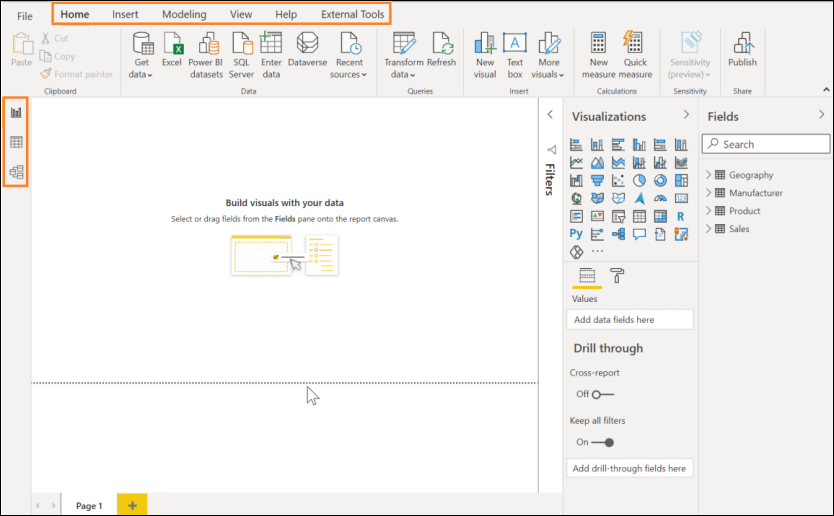
   
1. On the top of the window, you see the **Home** tab where the most common operations you perform are available.

2. The **Insert** tab in the ribbon allows you to insert shapes, a text box or new visuals

3. The **Modeling** tab in the ribbon enables additional data modelling capabilities like adding custom columns and calculating measures. 

4. The **View** tab has options to format the page layout. 

5. The **Help** tab provides self-help options like guided learning, training videos and links to online communities, partner showcase and consulting services.

6. On the left side of the window, you have three icons, **Report**, **Data** and **Model**. If you hover over the icons, you can see the tooltips. Switching between these allows you to see the data and the relationships between the tables.

7. The center **white space** is the canvas where you will be creating visuals.

8. The **Visualizations** panel on the right allows you to select visualizations, add values to the visuals,and add columns to the axis or filters.

9. The **Fields** window on the right panel is where you see the list of tables which were generated from the queries. Click the :arrow_down_small: icon (downward facing triangle) next to a table name to expand the field list for that table.

   

10. Click on the **Data** icon on the left side. Expand the **Sales** table in the **Fields** pane as shown in the figure above. Scroll up and down to notice how fast you can navigate through over three million rows.

    
    
11. Click on the **Model** icon on the left panel of Power BI Desktop. You see the tables you have imported along with Relationships. The Power BI Desktop automatically infers relationships between the tables. 
  - A relationship is created between the Sales and Product tables using the **ProductID** column.
  - A relationship is created between the Product and Manufacturer tables using the **ManufacturerID** column.

    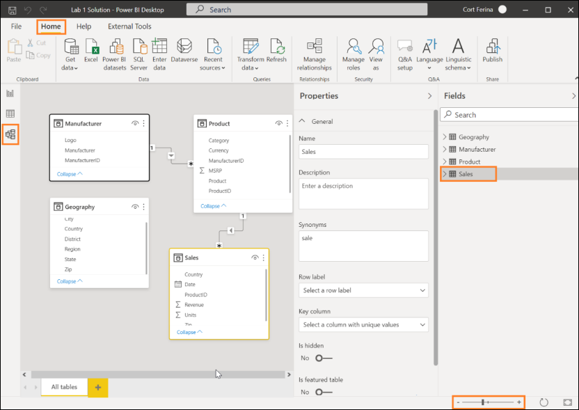
  
Power BI supports multiple types of relationships:
  - 1 to many 
  - 1 to 1 
  - Many to many 

In this lab, we will be using the 1 to many type of relationship, the most common type of relationship. This means one of the tables involved in the relationship should have a unique set of values. We will create additional relationships later in this lab. 

>**Note**: Tables may not appear as shown in the figure. You can zoom in and out of the **Relationships** page by dragging the zoom slider in the bottom right corner of the window. Also, if you want to ensure you are seeing all the tables, use the fit to screen icon:  . Drag and move the tables to appear as shown in the figure:

   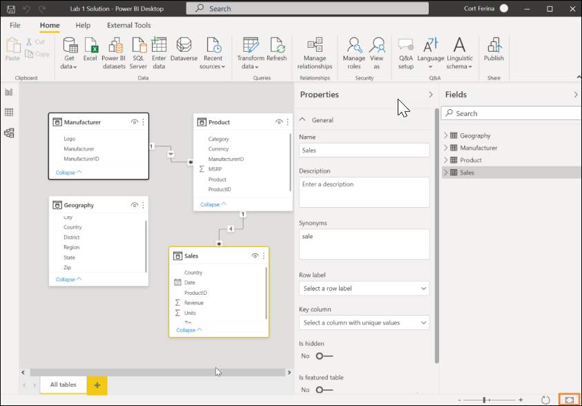
   
12. Click on the Search box and notice the options available. The options change based on what you are clicked on in canvas

    
    
### Task 2 - Power BI Desktop – Data Exploration 

Now that we have loaded data, let’s start with analyzing sales by country.

13. Click on the **Report** icon on the left panel to navigate to the Report view.

14. Click the **Clustered column chart** visual in **Visualizations** as shown in the screenshot.

    
    
15. From the **Fields** section, expand the **Geography** table and then click the checkbox next to the **Country** field.

16. From the **Fields** section, expand the **Sales** table and then click the checkbox next to the **Revenue** field.

17. **Resize** the visual as needed by dragging the edges.

    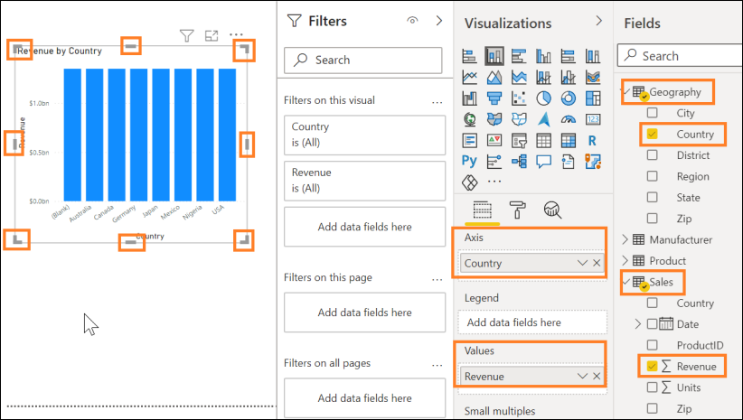
    
 Notice that the revenue of each country is the same. Now we need to create a relationship between the Sales and Geography tables.

18. Click on the **Model** icon on the left panel to navigate to the Relationship view.

19. Our sales data is by **Zip** code, so we need to connect the Zip column from the **Sales** table with **Zip** column in the **Geography** table. You can do this by dragging the **Zip** field in the **Sales** table to connect the line with the **Zip** field in the **Geography** table.

    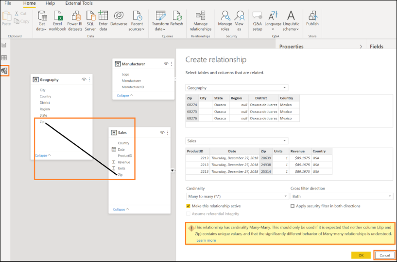
    
    You will notice the **Create relationship** dialog opens with a warning message at the bottom stating the relationship has a many-many cardinality. The reason for the warning is that we don’t have unique Zip values in the **Geography** table. This is because multiple countries could have the same Zip code. Let’s 
concatenate the **Zip** and **Country** columns to create a unique value field.

20. Click **Cancel** in the **Create relationship** dialog box.

    We need to create a new column in both the Geography table and the Sales table that combines the **Zip** and **Country** columns. Let’s start by creating a new column in the Sales table. 

21. Click on the **Report** icon on the left panel to navigate to the **Report** view.

22. In the **Fields** section, click on the ellipse next to the **Sales** table. Click the **New Column** as shown in the figure. You will see a formula bar appear, as shown in the screenshot, to help create this new column.

    
    
23. Now we are ready to combine the Zip and Country columns into a new column called **ZipCountry**, separated by a comma. To create this column called ZipCountry, type the following calculation in the editor.
         
    ```bash
    ZipCountry = Sales[Zip] & "," & Sales[Country]
    ```

    

24. Once you are done entering the formula press **Enter** or click the checkmark on the left side of the formula bar. 

    You will notice that IntelliSense appears guiding you to choose the correct column. The language you used to create this new column is called Data Analysis Expression (DAX). We are connecting columns (Zip and Country) in each row by using the “&” symbol. The icon with an (fx), near the new column ZipCountry, indicates that you have a column containing an expression, also referred to as a calculated column.

**IMPORTANT**: If you get an error creating a new column, make sure your Zip column is the Text Data Type.

>**Note**: An alternative way to add a new column is by selecting the table, click **Table Tools**, click **New Column** or **Modeling**, and then click **New Column** from the ribbon.

   
   
   Let us use this method to create a **ZipCountry** column in the **Geography** table. 

25. From the Fields section, click the **Geography** table, from the ribbon click **Modeling**, and then click **New Column** as shown in the figure.

    

26. A formula bar now appears. Enter the following DAX expression in the formula bar: 

    ```bash
    ZipCountry = Geography[Zip] & "," & Geography[Country]
    ```
          
    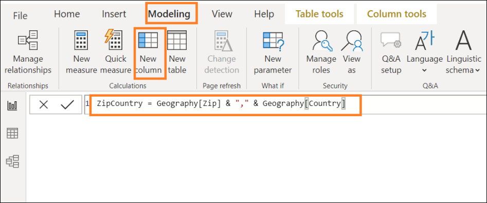

You will see a new column, **ZipCountry**, in the **Geography** table. The final step is to set up the relationship between the two tables using the newly created **ZipCountry** columns in each of these tables.

27. Click on the **Model** icon on the left panel to navigate to the **Relationship** view.

28. Drag the **ZipCountry** field from the **Sales** table and connect it to the **ZipCountry** field in the **Geography** table.

    
    
Now we have successfully created a relationship. The number “1” next to Geography indicates it is on the one side of the relationship and the “*” next to Sales indicates it is on the many side of the relationship.

29. Click on the **Report** icon on the left panel to navigate to the **Report** view.

Notice the clustered column chart that we created earlier. It shows different sales for each country or region. USA has the most sales, followed by Australia and Japan. By default, the chart is sorted by **Revenue**.

30. Click on the **ellipse** on the top right corner of the visual (alternatively, the ellipse may be at the bottom of the chart). Notice there is an option to Sort axis by **Country** as well.

    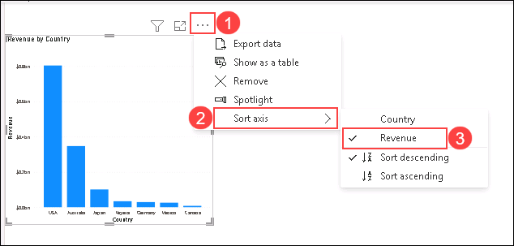

31. Notice that we have some blanks in our data. We want to clean up our data and get rid of the blanks

32. Drag the **Country** field from the **Geography** table to the Filters pane and drop it in **Filters on all pages**

33. Change filter type to **Advanced filtering** and select **is not blank**, click on **Apply Filter**
 
 >**NOTE**: Additional filter options are available: is blank, is empty, is not empty

   

34. From the **Fields** section, expand the **Manufacturer** table, and then drag the **Manufacturer** column to the **Legend** section under Visualizations.

35. While you have your chart selected, click the **Clustered column chart** from the **Visualizations** section, and then click the **Stacked column chart** visual.

36. **Resize** the visual as needed.

    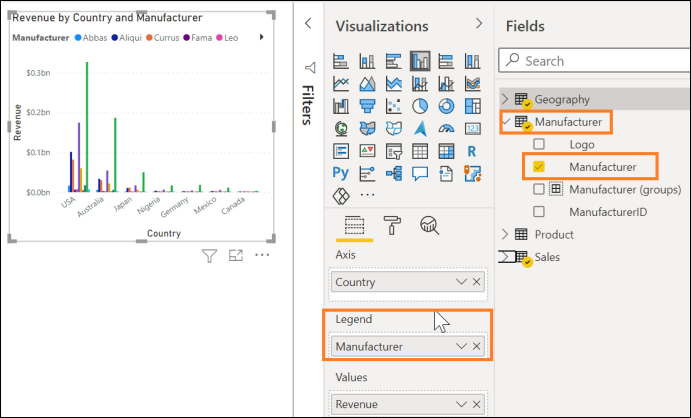

Now we can see the top manufacturers by country. 

Now let’s try different visuals to see which chart represents the data the best.

37. Begin with the **Stacked column chart** selected.

    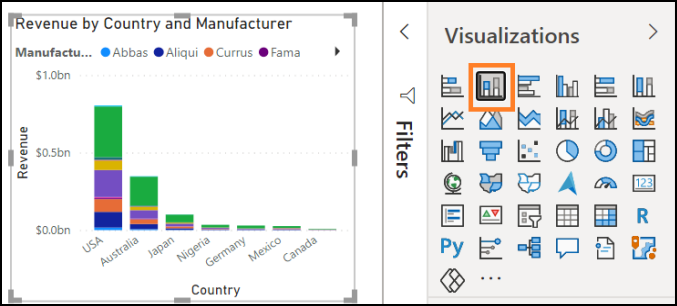

38. Sort the legend in descending order

    
    
39. In the **Filters** pane, expand **Manufacturer**.

40. From the **Filter Type** dropdown menu, click **Top N**.

41. Enter **5** in the text box next to **Top**.

42. From the **Sales** table, drag and drop the **Revenue** field into the **By value** section.

43. Click on **Apply filter**.

    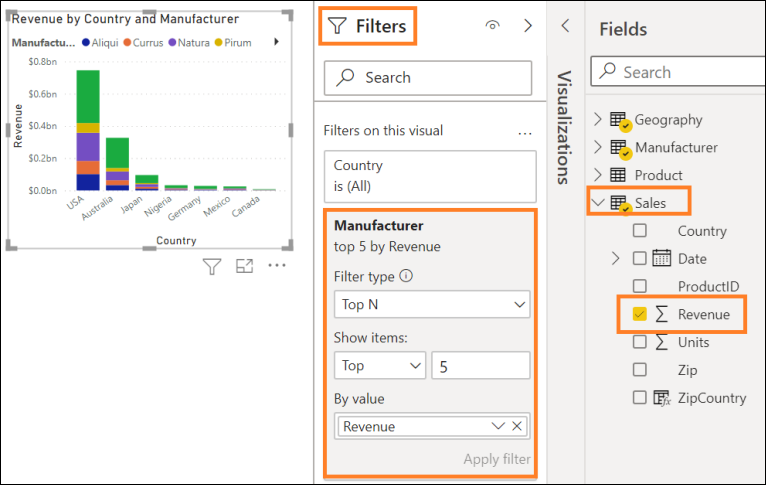

Notice that the visual is filtered to display the top five manufacturers by Revenue. We see that the manufacturer VanArsdel has a higher percentage of sales in Australia compared to other countries or regions.

We can now add total labels to the stacked visuals

44. Lets explore font formatting options

45. Click on the **paint roller icon** and click on **X axis**

46. Turn on **Bold** and **Italic** – feel free to try different formatting option on different areas. For the purpsoe of the lab we will turn off Bold and Italic

    

47. Navigate to the **Total labels** heading and click to **On**

    
    
Let’s remove the total labels

48. Click Total labels to the **Off** position

We are interested in the top five competitors by revenue. Let’s group them so we don’t have to add a filter to every visual. Before we do that, we’ll remove the **Top 5** visual level filter.

49. Begin with **Stacked column chart** selected.

50. Hover over and click the **Clear filter** icon (erase) next to **Manufacturer** field in the **Filters** Pane.

    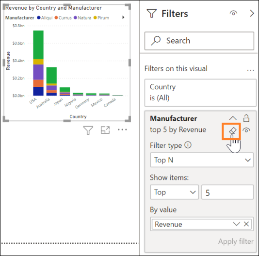

51. From the **Fields** section, right-click on the **Manufacturer** field name from **Manufacturer** table.

>**Note**: do not check the checkbox.

52. Click **New Group**.

53. In the **Ungrouped values** section, using **Ctrl** key, click **Aliqui**, **Currus**, **Natura**, and **Pirum**.

54. Click the **Group** button. Notice a new group is added in the **Groups and members** section.

55. Double-click the newly created group and rename it **Top Competitors**.

56. Click **VanArsdel** from the **Ungrouped values** section and click the **Group** button to create the **VanArsdel** group.

57. Click the checkbox **Include Other group**. This will create another **Other** group that includes all the other manufacturers.

58. Click **OK** to close the **Groups** dialog.

    
    
59. With the **Stacked column chart** selected, click on the **X** next to **Manufacturer** in the **Legend** section. This will remove the Manufacturer.

60. From the **Fields** section, drag the newly created **Manufacturer (groups)** to the **Legend** section.Now we can see that VanArsdel has nearly 50% share in Australia.

    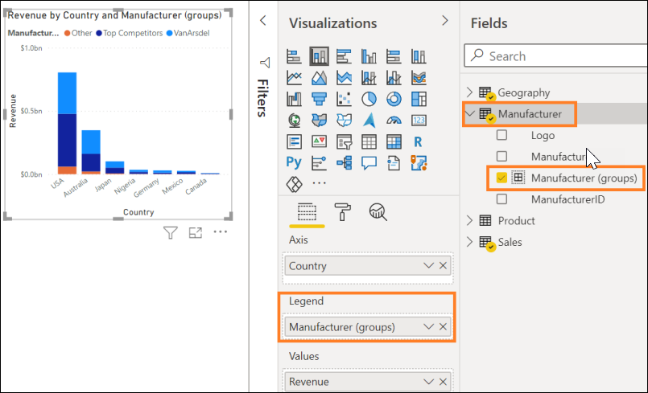

61. Hover over one of the columns and right-click.

62. Click **Show as a table**. You will now be in **Focus** mode with the chart displayed on top and the data displayed below. Notice that VanArsdel has a large percent of the Australian market.

63. Use the icon in the top right corner to switch to the vertical layout. In this layout, you view the chart on the left panel and the data on the right panel.

64. Click **Back to Report** to go back to the **Report** canvas.

    

 >**Note**: You can use similar steps to Show data point as a table to see records for a specific data point.

Now let’s create a Revenue by Manufacturer visual.

65. Click on the white space in the canvas. From the **Fields** section, click the checkbox next to the **Revenue** field in the **Sales** table.

66. From the **Fields** section, click the checkbox next to the **Manufacturer** field in the **Manufacturer** table.

67. From the **Visualizations** section, click the **Treemap** visual.

    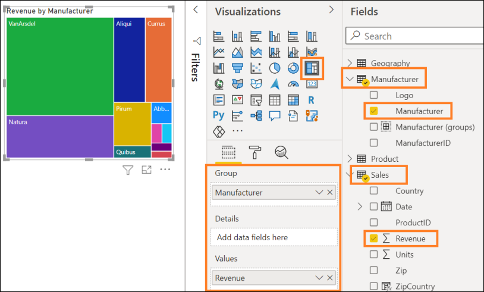
    
We now have Revenue by Manufacturer. Now let’s turn our attention to the interaction between the Stacked column chart and the Treemap visuals.

68. In the **Treemap**, click **VanArsdel** and notice that the Stacked column chart is filtered. This confirms that VanArsdel has a large percentage of the Australian market.

    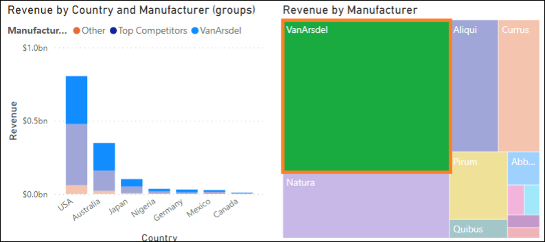
    
69. To remove the filter, click **VanArsdel** again.

This interaction between visuals is called cross-filtering.

Previously, we added a Top 5 Visual level filter. Now let’s add a filter to the Page level, so we are working with the Top Competitors and VanArsdel and filter out the other manufacturers.

Page-level filters apply to all visuals on the page. Visual-level filters apply only to a visual. Ensure the Filters pane is expanded/open.

70. From the **Fields** section, drag **Manufacturer (groups)** from the **Manufacturer** table to the **Filters on this page** box in the **Filters Pane**.

71. Click **Top Competitors** and **VanArsdel**.

    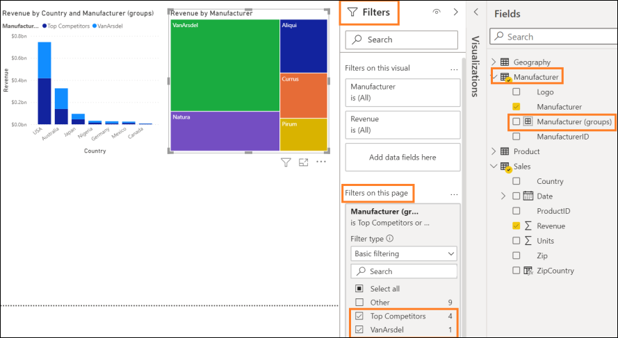

Now, let’s add a visual that provides sales information over time

72. Begin by clicking on the white space in the canvas and select **Clusterd column chart** from Visualizations.

73. Click the checkbox next to the **Date** field in the **Sales** table. Notice that a Date Hierarchy is created. 

74. Click the checkbox next to the **Revenue** in the **Sales** table field. Notice that a Clustered column chart is created. Also notice in the **Axis** section, a date hierarchy is created. There are arrows on the top bar of the chart which are used to navigate through the hierarchy.

    

75. Click on the **Australia** column in the **Revenue by Country** visual.

76. With the **Revenue by Country** visual selected, from the ribbon click on **Format**, and then click **Edit Interactions**. Notice on the top right of the other two visuals new icons with the highlight icon selected.

77. Click the **filter icon** for both visuals.

    
    
Notice now in both Revenue by Year and Revenue by Manufacturer, data is filtered for Australia

78. Now click the **Revenue by Year** visual.

79. Next, click the **filter** icon on the other two visuals.

    

80. Similarly, click on the **Revenue by Manufacturer** visual and click the **filter icon** on the other **two visuals**. Once you are done, all the visuals should be in filter mode.

81. With the **Revenue by Manufacturer** visual selected, from the ribbon click **Format** then **Edit Interactions** to remove the icons.

82. Click on VanArsdel in the Revenue by Manufaturer visual

>**Note**: If your screen doesn’t look like the one below please edit your interactions.

   

We have already noticed that VanArsdel has a large share of the market in Australia. Let’s see how VanArsdel has done over time in Australia.

83. Click on the **Revenue by Country and Manufacturer (groups)** chart and remove **Manufacturer (groups)** from the legend.

84. Click on **VanArsdel** in the **Revenue by Manufacturer** visual.

85. **Ctrl+Click** the **Australia column** in the **Revenue by Country** visual. 

Now we have filtered the charts by both VanArsdel and Australia. Looking at the results, we can see a spike in 2021 sales for VanArsdel in Australia. This spike in sales is intriguing, so let’s investigate further.

86. Click the down arrow on the top of the **Revenue by Year** visual. This enables drill-down capability.

    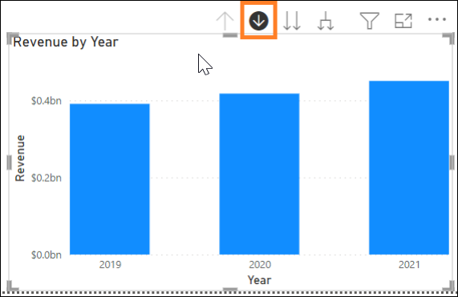
    
87. Click the **2021** column in the **Revenue by Year** visual.

Notice that you have drilled down to the quarter level of 2021. There was a big spike in the fourth quarter. Let’s dig further.

88. Click on the double arrow icon on the top of the **Revenue by Year** visual. This drills down to the next level of the hierarchy, which is the month.

    

89. Click on the up-arrow icon on the top of the **Revenue by Year** visual to drill up to the **Quarter** level.

90. Click on the drill up icon again to go up to the **Year** level

91. Click on the split arrow icon on the top right of the **Revenue by Year** visual. This expands down to the next level of the hierarchy, which is quarters for all the years.

Notice that the fourth-quarter sales have always been high, but in 2021 there was a larger sales spike in the fourth quarter than usual.

92. Now let’s expand down to the month level. Click on the split arrow icon on the top right of the **Revenue by Year** visual. This expands down to the next level of the hierarchy, which is months for all the years.

There is a lot of information in the visual and we must scroll left and right to compare.

## References

Dashboard in a Day introduces you to some of the key functions available in Power BI. In the ribbon of the Power BI Desktop, the Help section has links to some great resources.

      

Here are a few more resources that will help you with your next steps with Power BI.

  - Getting started: http://powerbi.com
  - Power BI Desktop: https://powerbi.microsoft.com/desktop
  - Power BI Mobile: https://powerbi.microsoft.com/mobile
  - Community site https://community.powerbi.com/
  - Power BI Getting started support page: https://support.powerbi.com/knowledgebase/articles/430814-get-started-with-power-bi
  - Support site https://support.powerbi.com/
  - Feature requests https://ideas.powerbi.com/forums/265200-power-bi-ideas
  - New ideas for using Power BI https://aka.ms/PBI_Comm_Ideas
  - Power BI Courses http://aka.ms/pbi-create-reports
  - Power Platform https://powerplatform.microsoft.com/en-us/instructor-led-training/
  - Power Apps [Business Apps | Microsoft Power Apps](https://powerapps.microsoft.com/en-us/)
  - Power Automate [Power Automate | Microsoft Power Platform](https://powerapps.microsoft.com/en-us/)
  - Dataverse [What is Microsoft Dataverse? - Power Apps | Microsoft Docs](https://docs.microsoft.com/en-us/powerapps/maker/data-platform/data-platform-intro)

