# Lab 6 - Share Power BI App in your Organization

**Contents** 

<!-- TOC -->
- [Introduction](#introduction)
- [Power Bi- Share Power Bi App](#power-BI–create-ad-user)
  - [Power BI – Create AD user ](#power-bi-link-settings)
  - [Power BI – Link settings](#power-bi-link-settings)
  - [Power BI – Manage Permissions to a Report](#power-bi-manage-permissions-to-a-report)
- [Power BI – Share a Dashboard](#power-bi-share-a-dashboard)
  - [Power BI – Manage Permissions to a Dashboard](#power-bi-manage-permissions-to-a-dashboard)
- [References](#references)

## Introduction

**Sharing** is the easiest way to give people access to your reports and dashboards in the Power BI service. You can share with people inside or outside your organization.

When you share a report or dashboard, the people you share it with can view it and interact with it but can't edit it. They see the same data that you see in the reports and dashboards and get access to the entire underlying dataset unless row-level security (RLS) is applied to the underlying dataset. The coworkers you share with can reshare with their coworkers if you allow them to.

   

The Power BI service offers other ways to collaborate and distribute reports and dashboards, too. Read [Ways to collaborate and share in Power BI](https://docs.microsoft.com/en-us/power-bi/collaborate-share/service-how-to-collaborate-distribute-dashboards-reports) to see which way works best for your circumstances.

Where you can share:

- You can share reports and dashboards from My Workspace.
- You can share from workspaces other than My Workspace, if you have the Admin or Member role in the workspace. If you have the Contributor or Viewer role, you can share if you have Reshare permissions.
- You can share from the Power BI mobile apps.
- You can't share directly from Power BI Desktop. You publish reports from Power BI Desktop to the Power BI service.

## Task 1: Azure Portal - Create an AD User

1. In the **LabVM**, click on the **Azure Portal** shortcut of Microsoft Edge browser which is created on the desktop 💻.
  
    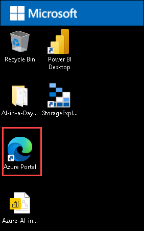
    
2. On the **Sign into Microsoft Azure** tab you will see the login screen, in that enter following **Email/Username** and then click on **Next**. 
   * Email/Username: <inject key="AzureAdUserEmail"></inject>
   
3. Enter the following **Password** and click on **Sign in**. 
   * Password: <inject key="AzureAdUserPassword"></inject>

4. Click **Skip for now (14 day until this is required)**
   
5. If you see the pop-up **Stay Signed in?**, click **No**. Also, if you see a **Save Password** popup, close that.

6. If you see the pop-up **You have free Azure Advisor recommendations!**, close the window to continue the lab.

7. If **Welcome to Microsoft Azure** popup window appears, click **Maybe Later** to skip the tour.

8. In the Global search bar, type **Azure Active Dircetory** and select as below;

   

9. Select **Users** under Manage and click **+New User**.

10. Ensure to select the Create User box and provide the desired **user name**, **Name** and also please take a note of the password for the user and then clik **Create**

    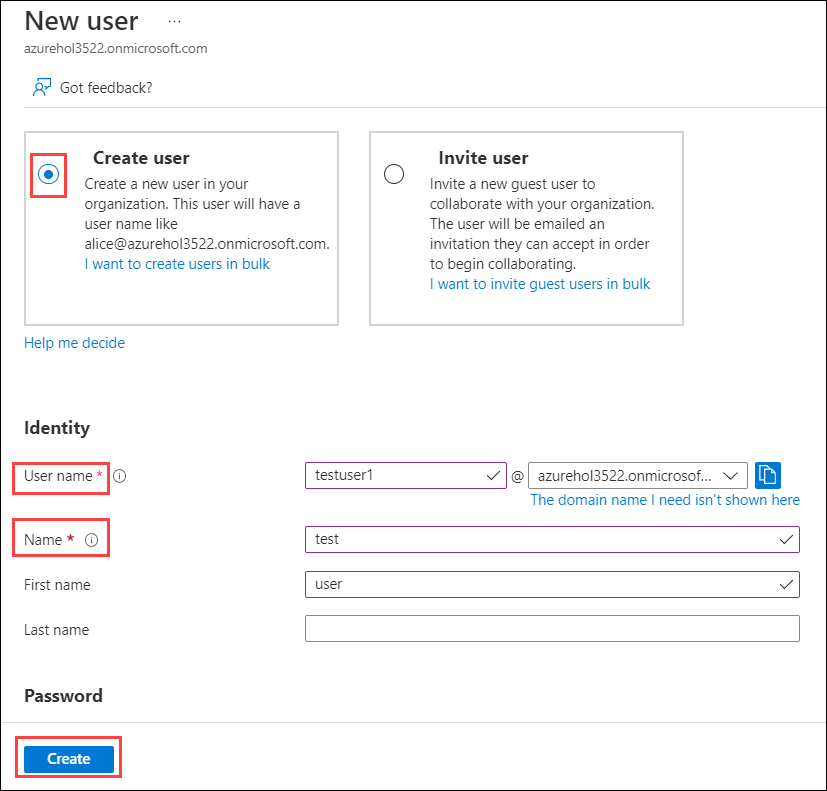
    
11. Minimize the Azure portal and navigate back to PowerBi desktop.

12. In a list of reports, or in an open report, select **Share** .

13. Then in the **Send link** dialog, you'll see the option to copy the sharing link or share it via Outlook and Teams to **People in your organization**

   

>**Note**: Your organization may not allow you to create shareable links to **People in your organization**. Learn more about this **tenant setting** in the admin portal documentation.

14. Selecting **Copy link** will automatically generate and copy a shareable link to your clipboard.

   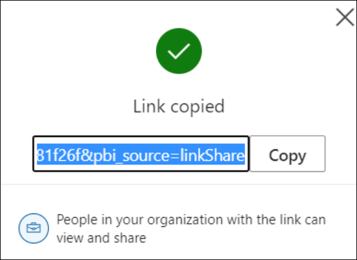

15. You can also choose to directly send the link to **Specific people** or groups (distribution groups or security groups). Just enter their name or email address of the user we have created in the previous steps, optionally type a message, and select **Send**.

   

16. After you select **Send**, Power BI sends the link via email to your recipients.

   

17. When your recipients receive the email, they can select **Open this report** and automatically get access to the report through the shareable link.

   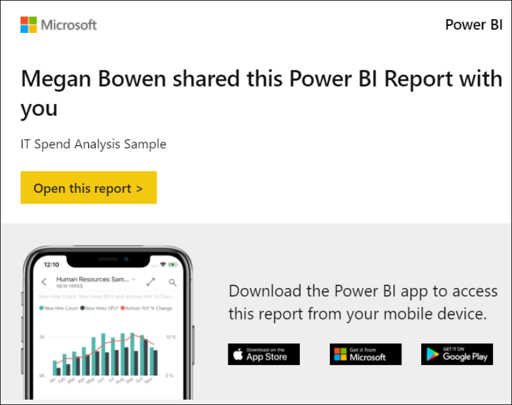

### Power BI – Link settings

You can choose who your sharing link gives access to and what they can do with the report and associated data:

   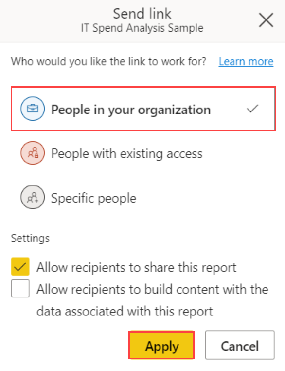

- **People in your organization**

  This type of link can allow people in your organization to access the report. This link will not work for external users nor guest users. Use this link when you want to share with someone in your organization and are comfortable with them passing the link around to other people inside your organization, but when you want to ensure that the link won’t work for external nor guest users.
  
- **People with existing access**

  This type of link generates a URL to the report, but it does not give any access to the report. Use this if you just want to send a link to somebody who already has access.

- **Specific people**

  This type of link allows specific people or groups to access the report. If you select this option, enter the names or email addresses of the people you wish to share with. With this link type you can share to guest users in your organization’s Azure Active Directory (AAD), but you cannot share to external users who are not guests in your organization.

### Settings

Links that give access to **People in your organization** or **Specific people** will always include at least read access. However, you can also specify if you want the link to include or exclude the following permissions as well:

- Reshare permissions (included by default) – allows recipients to share the report to others
- Build permissions (excluded by default) – allows recipients to build their own reports in other workspaces based on the data associated with the report. Read more about [creating reports based on datasets from different workspaces](https://docs.microsoft.com/en-us/power-bi/connect-data/service-datasets-discover-across-workspaces).

Links for **People with existing access** do not have any additional settings because these links do not give any access to the report.

### Additional considerations

1. If a user tries to access a report using a link that they don't have access to, they can only access the report if there is another link granting them access or they have direct access to the report.

2. If your tenant admin has disabled shareable links to **People in your organization**, you can only copy and share links to **Specific people** or **People with existing access**.

3. If you have reshare permissions to the report but, you do not have reshare permissions to the report’s underlying data, your shareable links will not give access to the underlying data.

4. If you don't have reshare permissions to the report, you can only copy and share links to **People with existing access**.

5. Additionally, if you don't have a Power BI Pro License, you can only copy and share links to **People with existing access**.

## Task 2: Power BI – Manage Permissions to a Report

1. To manage permission and manage links that give access to the report, select **More options (...)** in the upper right of the sharing dialog, and then select **Manage permissions**.

   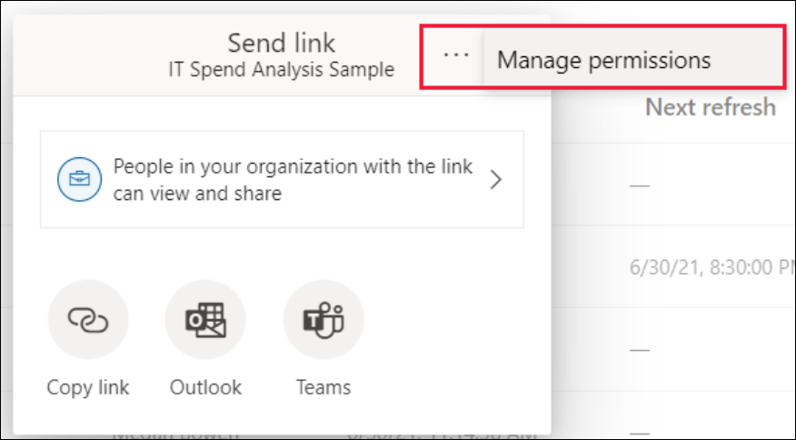

2. This will launch the **Manage permissions** pane where you can copy or modify existing links or grant users direct access. To modify a given link, select **More options (...)**.

   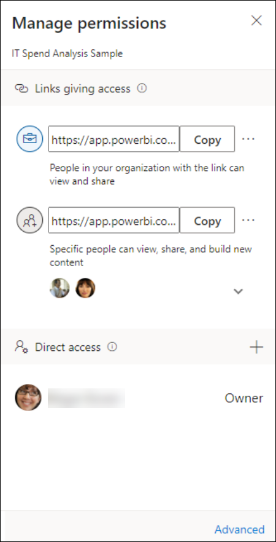

3. To grant users direct access to the report select the plus icon (+), enter their name or email address of the user we have created in the previous task and optionally type a message, and select **Grant access**.

   

4. For additional access management capabilities, select the **Advanced** option in the footer of the **Manage permissions** pane. This takes you to the management page, where you can:

   - View, manage, and create **Links**.
   - View and manage who has **Direct access** and grant people direct access.
   - View and manage **Pending** access requests and invitations.
   - View and manage **Related content**.
   - Apply **Filters** or **Search** for specific links or people.

  

>**Note**: Each report cannot have more than 1,000 sharing links. In the unlikely case that your report hits this max limit, we recommend removing links that give **Specific people** access and instead grant those users direct access.

## Task 3: Power BI – Share a Dashboard

1. In a list of dashboards, or in an open dashboard, select **Share** .

2. Then in the **Share dashboard** dialog, you'll see the option to grant users or groups direct access to the dashboard.

   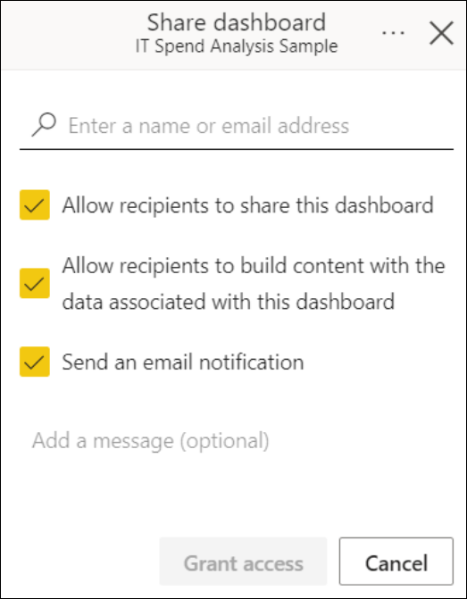
   
3. Enter the name or email address of the user or group, optionally type a message, and click **Grant access**.  
   
   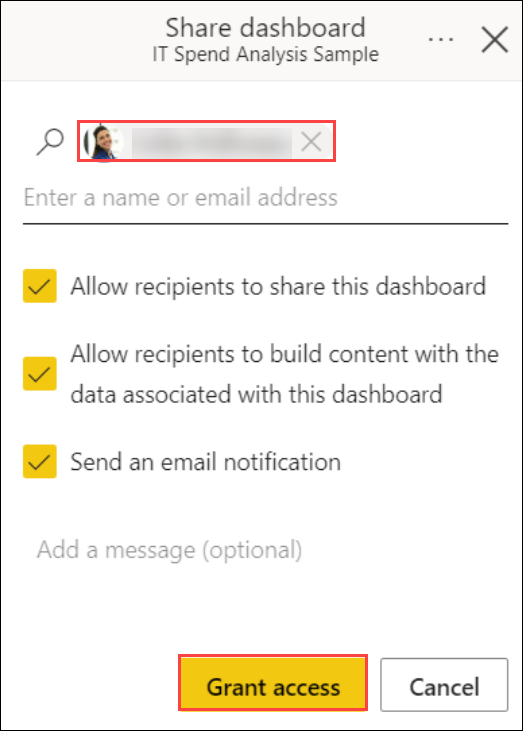
   
4. Similar to report sharing, you can specify if you want to grant users the following permissions as well:

   - Reshare permissions (included by default) – allows recipients to share the dashboard to others
   - Build permissions (included by default) – allows recipients to build content with the data associated with the dashboard  
   
You can share the dashboard with guest users whose addresses are outside your organization, but guest users cannot reshare dashboards. Read more about [sharing outside your organization](https://docs.microsoft.com/en-us/power-bi/collaborate-share/service-share-dashboards#share-outside-your-organization) in this article.

>**Note**: The input box supports, at most, 100 separate users or groups. See [Share with more than 100 users](https://docs.microsoft.com/en-us/power-bi/collaborate-share/service-share-dashboards#share-with-more-than-100-separate-users) in this article for ways to share with more people.
   
## Task 4: Power BI – Manage Permissions to a Dashboard   
   
1. To manage permission to the dashboard, select the **More options menu (...)** in the upper right of the **Share dashboard** dialog, and then select **Manage permissions**.
   
    
   
2. This will launch the **Manage permissions** pane where can see who has direct access and click the plus icon (+) to grant more users direct access to the dashboard.

     
   
3. For additional access management capabilities, select the Advanced option in the footer of the Manage permissions pane. This will navigate you to the management page where you can:

   - View and manage who has **Direct access** and grant people direct access
   - View and manage **Pending** access requests and invitations
   - View and manage **Related content**
   - Apply **Filters** or **Search** for specific people   
   
  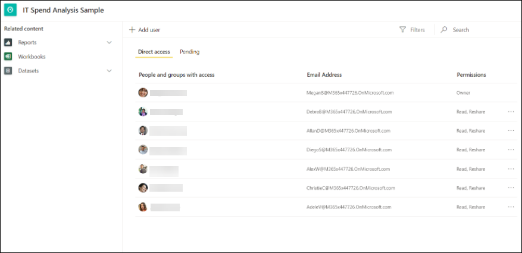 
  
4. To remove a user's access to the dashboard, select the ellipsis (...) next to that user's permissions and select **Remove access**.  
  
   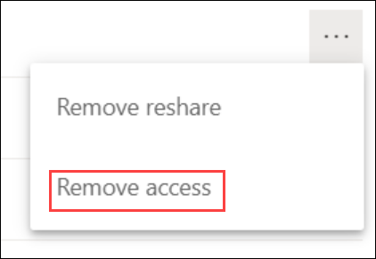
  
5. In the **Remove access** dialog, decide if you also want to remove access to related content, such as reports and datasets. It's best to also remove access to related content; otherwise, the related content may not display properly. 
  
   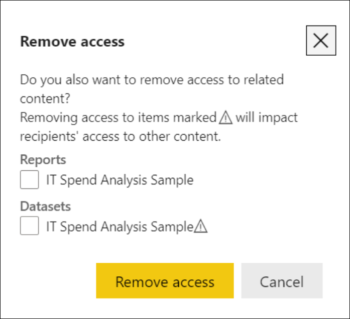
  
## References

Dashboard in a Day introduces you to some of the key functions available in Power BI. In the ribbon of the Power BI Desktop, the Help section has links to some great resources.

   

Here are a few more resources that will help you with your next steps with Power BI.

  - Getting started: http://powerbi.com
  - Power BI Desktop: https://powerbi.microsoft.com/desktop
  - Power BI Mobile: https://powerbi.microsoft.com/mobile
  - Community site https://community.powerbi.com/
  - Power BI Getting started support page: https://support.powerbi.com/knowledgebase/articles/430814-get-started-with-power-bi
  - Support site https://support.powerbi.com/
  - Feature requests https://ideas.powerbi.com/forums/265200-power-bi-ideas
  - New ideas for using Power BI https://aka.ms/PBI_Comm_Ideas
  - Power BI Courses http://aka.ms/pbi-create-reports
  - Power Platform https://powerplatform.microsoft.com/en-us/instructor-led-training/
  - Power Apps [Business Apps | Microsoft Power Apps](https://powerapps.microsoft.com/en-us/)
  - Power Automate [Power Automate | Microsoft Power Platform](https://powerapps.microsoft.com/en-us/)
  - Dataverse [What is Microsoft Dataverse? - Power Apps | Microsoft Docs](https://docs.microsoft.com/en-us/powerapps/maker/data-platform/data-platform-intro) 
  
