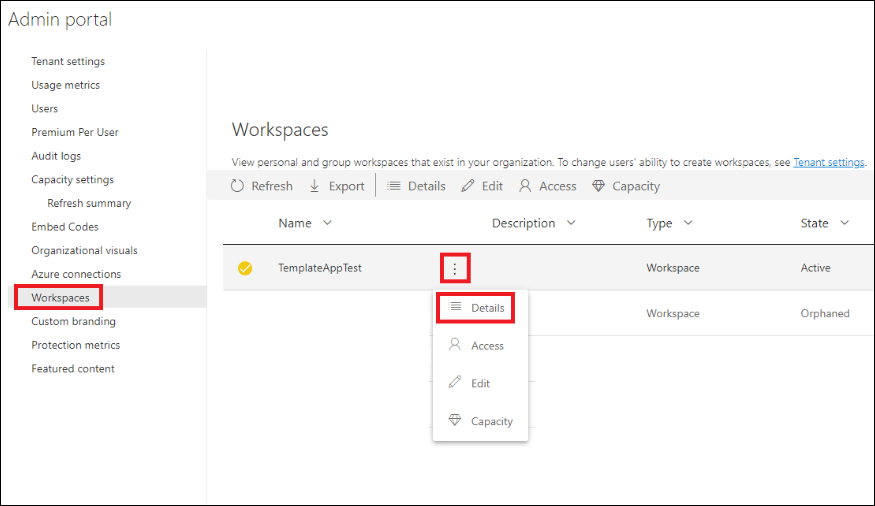
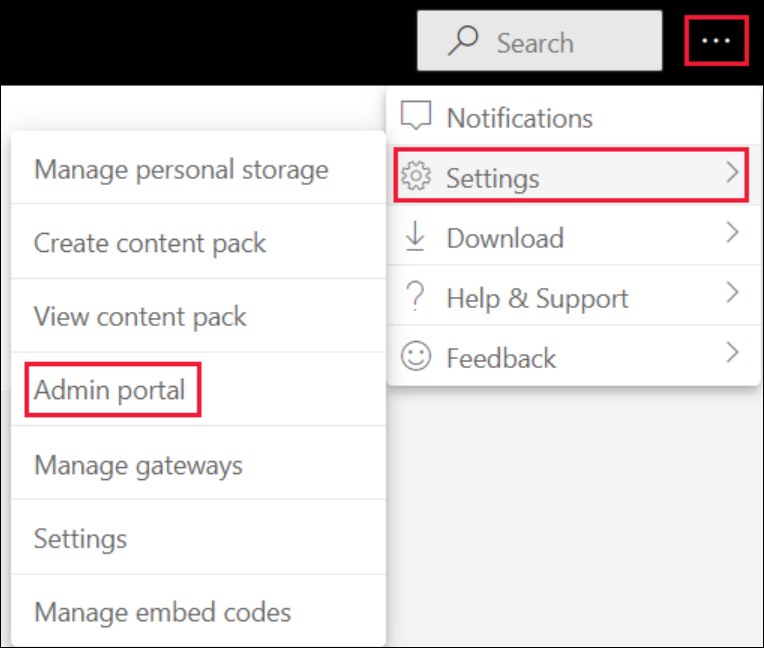

# Lab 7 - Embedded Power BI App in Web App

**Contents** 

<!-- TOC -->

- [Introduction](#introduction)
- [Embedded Power BI](#embedded-power-bi)

## Introduction

**Embedded analytics** and **Power BI Embedded** (the Azure offer) allow you to embed Power BI content such as reports, dashboards and tiles, into your application.

In this lab, you'll learn how to:

 - Set up your embedded environment.
 - Configure an embed for your customers (also known as app owns data) sample application.

To use application, users won't need to sign in to Power BI or have a Power BI license.

We recommend using the embed for users method to embed your Power BI content, if you're an independent software vendor (ISV) or a developer, who wants to create applications for third parties.

### Code sample specifications

This lab includes instructions for configuring an embed for sample application in one of the following frameworks:

 - .NET Framework
 - .NET Core
 - Java
 - Node JS
 - Python

The code samples support the following browsers:

 - Microsoft Edge
 - Google Chrome
 - Mozilla Firefox

## To create an embed for users sample app, follow these steps:

### Task 1 - Select your authentication method

Your embedded solution will vary depending on the authentication method you select. Therefore, it's important to understand the differences between the authentication methods, and decide which one best suits your solution.

The table below describes a few key differences between the [service principal](https://docs.microsoft.com/en-us/power-bi/developer/embedded/embed-service-principal) and **master user** authentication methods.

   | Consideration            | Service principal             | Master user             |
   | ------------------------ | ----------------------------- | ----------------------- |
   | Mechanism                | Your Azure AD app's [service principal object](https://docs.microsoft.com/en-us/azure/active-directory/develop/app-objects-and-service-principals#service-principal-object) allows Azure AD to authenticate your embedded solution app against Power BI.                              | Your Azure AD app uses the credentials (username and password) of a Power BI user, to authenticate against Power BI. |
   | Security                         | Service principal is the Azure AD recommended authorization method. If you're using a service principal, you can authenticate using either an application secret or a certificate. This lab only describes using service principal with an application secret. To embed using a service principal and a certificate, refer to the [service principal with a certificate](https://docs.microsoft.com/en-us/power-bi/developer/embedded/embed-service-principal-certificate) article.                              | This authentication method isn't as secure as a service principal. You have to be vigilant with the master user credentials (username and password). For example, don't expose them in your embedding application, and change the password frequently. |
   | Azure AD delegated permissions   | Not required.   | Your master user or an administrator has to grant consent for your app to access Power BI REST API [permissions](https://docs.microsoft.com/en-us/azure/active-directory/develop/v2-permissions-and-consent) (also known as scopes). For example, Report.ReadWrite.All. |
   | Power BI service access      | You can't access Power BI service with a service principal.    | You can access Power BI service with your master user credentials. |
   | License    | Doesn't require a Pro license. You can use content from any workspace that you're a member or an admin of. | Requires a [Power BI Pro](https://docs.microsoft.com/en-us/power-bi/enterprise/service-admin-purchasing-power-bi-pro) or Premium Per User (PPU) license. |

### Task 2 - Register an Azure AD application

Registering your application with Azure AD allows you to:

 - Establish an identity for your app
 - Let your app access the [Power BI REST APIs](https://docs.microsoft.com/en-us/rest/api/power-bi/)
 - If you're using a master user - Specify your app's [Power BI REST permissions](https://docs.microsoft.com/en-us/azure/active-directory/develop/v2-permissions-and-consent)

To register your application with Azure AD, follow the instructions in [Register your application](https://docs.microsoft.com/en-us/power-bi/developer/embedded/register-app).

> **Note**: Before registering your application, you'll need to decide which authentication method to use, service principal or master user.

### Task 3 - Get the embedding parameter values

To embed your content, you need to obtain certain parameter values. The table below shows the required values, and indicates if they're applicable to the service principal authentication method, the master user authentication method, or both.

Before you embed your content, make sure you have all the values listed below. Some of the values will differ, depending on the authentication method you're using.

   | Parameter                | Service principal     | Master user         |
   | ------------------------ | --------------------- | ------------------- |
   | [Client ID](https://docs.microsoft.com/en-us/power-bi/developer/embedded/embed-sample-for-customers?tabs=net-core#client-id)                |    |  |  
   | [Workspace ID](https://docs.microsoft.com/en-us/power-bi/developer/embedded/embed-sample-for-customers?tabs=net-core#workspace-id)             |    |  |
   | [Report ID](https://docs.microsoft.com/en-us/power-bi/developer/embedded/embed-sample-for-customers?tabs=net-core#report-id)                |    |  |
   | [Client secret](https://docs.microsoft.com/en-us/power-bi/developer/embedded/embed-sample-for-customers?tabs=net-core#client-secret)            |    |   |
   | [Tenant ID](https://docs.microsoft.com/en-us/power-bi/developer/embedded/embed-sample-for-customers?tabs=net-core#tenant-id)               |    |   |
   | [Power BI username](https://docs.microsoft.com/en-us/power-bi/developer/embedded/embed-sample-for-customers?tabs=net-core#power-bi-username-and-password)        |     |  |
   | [Power BI password](https://docs.microsoft.com/en-us/power-bi/developer/embedded/embed-sample-for-customers?tabs=net-core#power-bi-username-and-password)        |     |  |

### Client ID

>**Tip**: Applies to:  Service principal  Master user

To get the client ID GUID (also know as application ID), follow these steps:

1. Log into [Microsoft Azure](https://ms.portal.azure.com/#allservices).

2. Search for **App registrations** and select the **App registrations** link.

3. Select the Azure AD app you're using for embedding your Power BI content.

4. From the **Overview** section, copy the **Application (client) ID** GUID.

### Workspace ID

>**Tip**: Applies to:  Service principal  Master user

To get the workspace ID GUID, follow these steps:

1. Sign in to Power BI service.

2. Open the report you want to embed.

3. Copy the GUID from the URL. The GUID is the number between **/groups/** and **/reports/**.

   

Alternatively, you can find the workspace ID in the **Admin portal** settings by selecting **Details** next to the workspace name.

### Report ID

>**Tip**: Applies to:  Service principal  Master user

To get the report ID GUID, follow these steps:

1. Sign in to Power BI service.

2. Open the report you want to embed.

3. Copy the GUID from the URL. The GUID is the number between **/reports/** and **/ReportSection**.

   

### Client secret

>**Tip**: Applies to:  Service principal  Master user

To get the client secret, follow these steps:

1. Log into [Microsoft Azure](https://ms.portal.azure.com/#allservices).

2. Search for **App registrations** and select the **App registrations** link.

3. Select the Azure AD app you're using for embedding your Power BI content.

4. Under **Manage**, select **Certificates & secrets**.

5. Under **Client secrets**, select **New client secret**.

6. In the **Add a client secret** pop-up window, provide a description for your application secret, select when the application secret expires, and select **Add**.

7. From the **Client secrets** section, copy the string in the **Value** column of the newly created application secret. The client secret value is your client ID.

> **Note**: Make sure you copy the client secret value when it first appears. After navigating away from this page, the client secret will be hidden and you'll not be able to retrieve its value.

### Tenant ID

>**Tip**: Applies to:  Service principal  Master user

To get the tenant ID GUID, follow these steps:

1. Log into [Microsoft Azure](https://ms.portal.azure.com/#allservices).

2. Search for **App registrations** and select the **App registrations** link.

3. Select the Azure AD app you're using for embedding your Power BI content.

4. From the **Overview** section, copy the **Directory (tenant) ID** GUID.

### Power BI username and password

>**Tip**: Applies to:  Service principal  Master user

Obtain the username and password of the Power BI user you're using as your **master user**. This is the same user you used to create a workspace and upload a report to, in Power BI service.

### Task 4 - Service principal API access

> **Top**: Applies to:  Service principal  Master user

> **Note**: This step is only relevant if you're using the service principal authentication method. If you're using a master user, skip this step and continue with Step 7 - Enable workspace access.

For an Azure AD app to be able to access the Power BI content and APIs, a Power BI admin needs to enable service principal access in the Power BI admin portal. If you're not the admin of your tenant, get the tenant's admin to enable the Tenant settings for you.

1. In Power BI service, select **Settings** > **Settings** > **Admin portal**.

   
   
2. Select **Tenant settings** and then scroll down to the **Developer settings** section.

3. Expand **Allow service principals to use Power BI APIs**, and enable this option.

   

> **Note**: When using a service principal, it's recommended to limit its access to the tenant settings using a security group. To learn more about this feature, see these sections in the service principal article:
>- [Create an Azure AD security group](https://docs.microsoft.com/en-us/power-bi/developer/embedded/embed-service-principal#step-2---create-an-azure-ad-security-group)
>- [Enable the Power BI service admin settings](https://docs.microsoft.com/en-us/power-bi/developer/embedded/embed-service-principal#step-3---enable-the-power-bi-service-admin-settings)

### Task 5 - Embed your content

The Power BI embedded sample application allows you to create an embed for your customers Power BI app.

Follow these steps to modify the embed for your customers sample application, to embed your Power BI report.

1. Open the [Power BI developer samples](https://github.com/microsoft/PowerBI-Developer-Samples) folder in the virtual machine.

2. Select **Code** and then select **Download zip**.

   
   
3. Extract the downloaded ZIP and navigate to the **PowerBI-Developer-Samples-master** folder.

4. Depending on the language you want your app to use, open one of these folders:

   - .NET Core
   - .NET Framework
   - Java
   - Node JS
   - Python  

>**Note**: The embed for your customers sample applications only support the frameworks listed above. The React sample application only supports the **embed for your organization** solution.

5. Open the **Embed for your customers** folder.

6. Using **.NET Core**, open the embed for your customers sample app using one of these methods:

   - If you're using [Visual Studio](https://visualstudio.microsoft.com/), open the **AppOwnsData.sln** file.

   - If you're using [Visual Studio Code](https://code.visualstudio.com/), open the **AppOwnsData** folder.

7. Open **appsettings.json**.

8. Depending on your authentication method, fill in the following parameter values:

   | Parameter                | Service principal     | Master user         |
   | ------------------------ | --------------------- | ------------------- |
   | AuthenticationMode       | ServicePrincipal      | MasterUser          |  
   | ClientId                 | Your Azure AD app [client ID](https://docs.microsoft.com/en-us/power-bi/developer/embedded/embed-sample-for-customers?tabs=net-core#client-id)   | https://docs.microsoft.com/en-us/power-bi/developer/embedded/embed-sample-for-customers?tabs=net-core#client-id  |
   | TenantId                 | Your Azure AD [tenant ID](https://docs.microsoft.com/en-us/power-bi/developer/embedded/embed-sample-for-customers?tabs=net-core#tenant-id)   | N/A |
   | PbiUsername              | N/A   | Your master user username, see [Power BI username and password](https://docs.microsoft.com/en-us/power-bi/developer/embedded/embed-sample-for-customers?tabs=net-core#power-bi-username-and-password)  |
   | PbiPassword              | N/A   | Your master user password, see [Power BI username and password](https://docs.microsoft.com/en-us/power-bi/developer/embedded/embed-sample-for-customers?tabs=net-core#power-bi-username-and-password)   |
   | ClientSecret             | Your Azure AD [client secret](https://docs.microsoft.com/en-us/power-bi/developer/embedded/embed-sample-for-customers?tabs=net-core#client-secret)    | N/A   |
   | WorkspaceId              | The ID of the workspace with your embedded report, see [Workspace ID](https://docs.microsoft.com/en-us/power-bi/developer/embedded/embed-sample-for-customers?tabs=net-core#workspace-id)    | The ID of the workspace with your embedded report, see [Workspace ID](https://docs.microsoft.com/en-us/power-bi/developer/embedded/embed-sample-for-customers?tabs=net-core#workspace-id)  |
   | ReportId                 | The ID of the report you're embedding, see [Report ID](https://docs.microsoft.com/en-us/power-bi/developer/embedded/embed-sample-for-customers?tabs=net-core#report-id)   | The ID of the report you're embedding, see [Report ID](https://docs.microsoft.com/en-us/power-bi/developer/embedded/embed-sample-for-customers?tabs=net-core#report-id)  |
   
9. Run the project by selecting the appropriate option:

   - If you're using **Visual Studio**, select **IIS Express** (play).

   - If you're using **Visual Studio Code**, select **Run** > **Start Debugging**.   
   
## Developing your application

After configuring and running the embed for your customers sample application, you can start developing your own application.

When you're ready, review the [move to production](https://docs.microsoft.com/en-us/power-bi/developer/embedded/move-to-production) requirements. You'll also need a [capacity](https://docs.microsoft.com/en-us/power-bi/developer/embedded/embedded-capacity), and should review the [capacity planning](https://docs.microsoft.com/en-us/power-bi/developer/embedded/embedded-capacity-planning) article to establish which SKU best suits your needs.
   
   
   
   
   
   
   
   
   
